# Datasift Architecture

## Table of Contents

1. [Overview](#overview)
2. [System Architecture](#system-architecture)
3. [Core Concepts](#core-concepts)
4. [Component Deep Dive](#component-deep-dive)
5. [Distributed Execution Architecture](#distributed-execution-architecture)
6. [Operator Lifecycle](#operator-lifecycle)
7. [Data Flow Architecture](#data-flow-architecture)
8. [Integration Patterns](#integration-patterns)
9. [Design Decisions](#design-decisions)
10. [Repository Structure](#repository-structure)
11. [Development Guidelines](#development-guidelines)

---

This document describes the architecture and organization of the datasiftrepository.

## Overview

Datasift-open is a modular, operator-based data processing framework designed for building flexible document curation pipelines. It enables advanced RAG (Retrieval-Augmented Generation) workflows by combining structured data extraction, semantic chunking, vector embeddings, and hybrid search capabilities. It uses a mixed architecture approach comprising of dynamic plugin discovery across operators, hexagonal architecture in subsystems that need interchangeable external services. 

### Key Capabilities

- **Operator-Based Architecture**: 20+ specialized operators organized into 5 categories (Extract, Ingest, Functional, Quality, VectorDB)
- **PyArrow Data Format**: All data flows through the pipeline as PyArrow tables, ensuring efficient memory usage and interoperability
- **DAG-Based Workflow Execution**: Flows are defined as JSON configurations representing directed acyclic graphs (DAGs) of operator nodes
- **Prefect Orchestration**: Workflow execution managed by Prefect with support for both ephemeral (local) and distributed execution via work pools (Docker, Kubernetes / OpenShift)
- **Modern AI/ML Integrations**: Native support for Ollama (LLM operations), Docling (document processing), and OpenSearch (vector and scalar storage)

### Architectural Patterns

Datasift-opensource intentionally employs a **mixed architectural approach** rather than adhering to a single dominant pattern. This diversity enables flexibility, modularity, and maintainability across different system layers:

- **Hexagonal Architecture (Ports & Adapters)**: Core domain logic and operator abstractions are isolated from external dependencies, allowing operators to be framework-agnostic and easily testable. The Prefect orchestration module specifically uses hexagonal architecture with ports and adapters for batch execution strategies, enabling seamless switching between local and distributed execution modes.
- **Factory Pattern**: `OrchestratorFactory` and `OperatorFactory` provide centralized instantiation logic for orchestrators and operators
- **Strategy Pattern**: Different operator implementations can be swapped based on configuration without changing the orchestration logic
- **Observer Pattern**: Event handling system (`AbstractFlowExecutionEventHandler`, `FlowExecutionEventHandler`) enables monitoring and logging of flow execution
- **Template Method Pattern**: `AbstractOperator` defines the execution flow template while concrete operators implement specific behavior

This architectural diversity is a deliberate design choice that supports the framework's goal of being extensible, testable, and adaptable to various data processing scenarios.

### Use Cases

- Extract text and structured information from tables within unstructured documents (PDFs, DOCX, etc.)
- Combine vector similarity search with structured data filtering for improved retrieval accuracy
- Build custom document processing pipelines with configurable operators

### Technology Stack

| Layer | Technologies |
|-------|-------------|
| **Orchestration** | Prefect, Python 3.12+ |
| **Data Processing** | PyArrow |
| **Document Processing** | Docling |
| **LLM Integration** | Ollama, LiteLLM (unified interface supporting 100+ LLM providers including OpenAI, Anthropic, Google, AWS Bedrock, and more), HuggingFace |
| **Vector Storage** | OpenSearch, NMSLIB, Faiss |
| **Language Detection** | FastText, langdetect |
| **Web Framework** | FastAPI (optional) |
| **Testing** | pytest, pytest-cov |
| **Package Management** | uv |

---

## System Architecture

### High-Level Architecture Diagram

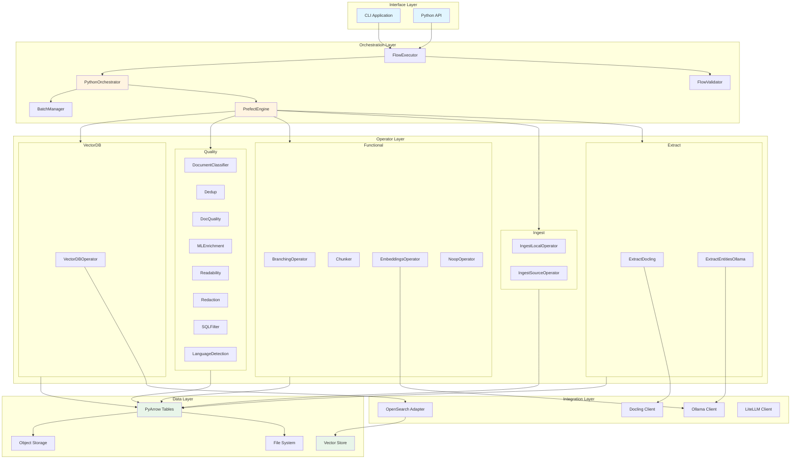
```mermaid
graph TB
    subgraph "Interface Layer"
        CLI[CLI Application]
        API[Python API]
    end

    subgraph "Orchestration Layer"
        FE[FlowExecutor]
        FV[FlowValidator]
        ORCH[PythonOrchestrator]
        PE[PrefectEngine]
        BM[BatchManager]
    end

    subgraph "Operator Layer"
        subgraph "Extract"
            ED[ExtractDocling]
            EE[ExtractEntitiesOllama]
        end
        subgraph "Ingest"
            ILO[IngestLocalOperator]
            ISO[IngestSourceOperator]
        end
        subgraph "Functional"
            BR[BranchingOperator]
            CH[Chunker]
            EMB[EmbeddingsOperator]
            NOOP[NoopOperator]
        end
        subgraph "Quality"
            DC[DocumentClassifier]
            DD[Dedup]
            DQ[DocQuality]
            MLE[MLEnrichment]
            RB[Readability]
            RD[Redaction]
            SF[SQLFilter]
            LD[LanguageDetection]
        end
        subgraph "VectorDB"
            VDB[VectorDBOperator]
        end
    end

    subgraph "Integration Layer"
        OLL[Ollama Client]
        DOC[Docling Client]
        OS[OpenSearch Adapter]
        LLM[LiteLLM Client]
    end

    subgraph "Data Layer"
        PA[PyArrow Tables]
        FS[File System]
        OBJ[Object Storage]
        VEC[Vector Store]
    end

    CLI --> FE
    API --> FE
    FE --> FV
    FE --> ORCH
    ORCH --> PE
    ORCH --> BM
    PE --> Extract
    PE --> Ingest
    PE --> Functional
    PE --> Quality
    PE --> VectorDB
    
    ED --> DOC
    EE --> OLL
    EMB --> OLL
    VDB --> OS
    
    Ingest --> PA
    Extract --> PA
    Functional --> PA
    Quality --> PA
    VectorDB --> PA
    
    PA --> FS
    PA --> OBJ
    OS --> VEC

    style CLI fill:#e1f5ff
    style API fill:#e1f5ff
    style ORCH fill:#fff4e1
    style PE fill:#fff4e1
    style PA fill:#e8f5e9
    style VEC fill:#e8f5e9
```

### Architecture Layers

**1. Interface Layer**
- CLI application for command-line flow execution
- Python API for programmatic access

**2. Orchestration Layer**
- FlowExecutor: Entry point for flow execution
- FlowValidator: Validates flow definitions
- PythonOrchestrator: Coordinates operator execution
- PrefectEngine: Manages workflow execution with Prefect
- BatchManager: Handles batch processing

**3. Operator Layer**
- 20+ specialized operators organized by category
- Each operator processes PyArrow tables
- Chainable in DAG workflows

**4. Integration Layer**
- Client abstractions for external services
- Ollama for LLM operations
- Docling for document processing
- OpenSearch for vector storage

**5. Data Layer**
- PyArrow tables for efficient data flow
- File system and object storage
- Vector database for embeddings

---
## Core Concepts

### 1. Operator Pattern

Operators are the fundamental building blocks of datasift. Each operator is a self-contained unit that performs a specific data processing task.

**Key Characteristics:**
- Inherits from [`AbstractOperator`](src/datasift_opensource/backend/core/operators/abstract_operator.py)
- Implements the Template Method pattern
- Receives PyArrow tables as input
- Returns PyArrow tables as output
- Configurable via JSON parameters
- Chainable in DAG workflows

**Operator Categories:**

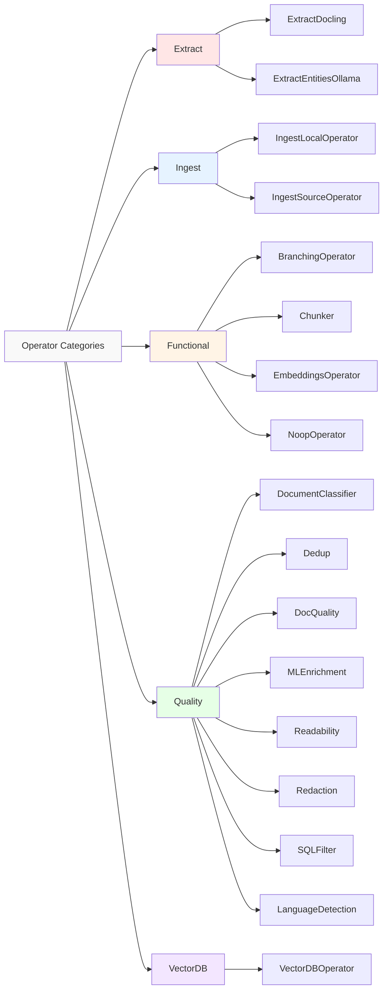
```mermaid
graph LR
    OP[Operator Categories]
    OP --> EXT[Extract]
    OP --> ING[Ingest]
    OP --> FUN[Functional]
    OP --> QUA[Quality]
    OP --> VDB[VectorDB]
    
    EXT --> E1[ExtractDocling]
    EXT --> E2[ExtractEntitiesOllama]
    
    ING --> I1[IngestLocalOperator]
    ING --> I2[IngestSourceOperator]
    
    FUN --> F1[BranchingOperator]
    FUN --> F2[Chunker]
    FUN --> F3[EmbeddingsOperator]
    FUN --> F4[NoopOperator]
    
    QUA --> Q1[DocumentClassifier]
    QUA --> Q2[Dedup]
    QUA --> Q3[DocQuality]
    QUA --> Q4[MLEnrichment]
    QUA --> Q5[Readability]
    QUA --> Q6[Redaction]
    QUA --> Q7[SQLFilter]
    QUA --> Q8[LanguageDetection]
    
    VDB --> V1[VectorDBOperator]

    style OP fill:#f9f9f9
    style EXT fill:#ffe6e6
    style ING fill:#e6f3ff
    style FUN fill:#fff4e6
    style QUA fill:#e6ffe6
    style VDB fill:#f3e6ff
```

### 2. Flow/Pipeline Concept

A **Flow** is a JSON-defined configuration that specifies:
- **DAG Structure**: Directed Acyclic Graph of operator nodes
- **Nodes**: Operator instances with unique UUIDs and configurations
- **Edges**: Data flow connections between operators via input/output edges
- **Parameters**: Runtime configuration values

**Example Flow Structure:**
```json
{
  "name": "Document Processing Pipeline",
  "flow_id": "a1b2c3d4-e5f6-7a8b-9c0d-1e2f3a4b5c6d",
  "description": "Ingest, extract, chunk, and embed documents",
  "dag": [
    {
      "id": "f1a2b3c4-d5e6-4f7a-8b9c-0d1e2f3a4b5c",
      "name": "ingest_local_folder",
      "operator": "ingest_local",
      "config": {
        "input_folder": "./sample_documents"
      },
      "input_edges": [],
      "output_edges": [{"node_id_ref": "e2b3c4d5-f6a7-4b8c-9d0e-1f2a3b4c5d6e"}]
    },
    {
      "id": "e2b3c4d5-f6a7-4b8c-9d0e-1f2a3b4c5d6e",
      "name": "extract_with_docling",
      "operator": "extract_docling",
      "config": {
        "doc_column": "content"
      },
      "input_edges": [{"node_id_ref": "f1a2b3c4-d5e6-4f7a-8b9c-0d1e2f3a4b5c"}],
      "output_edges": []
    }
  ]
}
```

**Key Structure Elements:**
- **Node IDs**: UUIDs for unique identification and traceability
- **Operator Names**: Short names (e.g., `ingest_local`, `extract_docling`) mapped to full class paths
- **Config**: Operator-specific parameters (not `operator_params`)
- **Input/Output Edges**: Both are required to define the complete DAG structure and enable bidirectional traversal

### 3. DAG-Based Execution Model

The execution model follows these principles:

1. **Topological Ordering**: Operators execute in dependency order
2. **Parallel Execution**: Independent operators run concurrently
3. **Data Passing**: PyArrow tables flow between operators
4. **Error Handling**: Failed operators propagate errors appropriately
5. **Batch Processing**: Large datasets processed in configurable batches

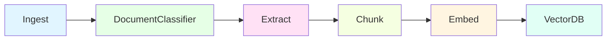
```mermaid
graph LR
    A[Ingest] --> B[DocumentClassifier]
    B --> C[Extract]
    C --> D[Chunk]
    D --> E[Embed]
    E --> F[VectorDB]
    
    style A fill:#e1f5ff
    style B fill:#e6ffe6
    style C fill:#ffe1f5
    style D fill:#f5ffe1
    style E fill:#fff5e1
    style F fill:#e1fff5
```

### 4. PyArrow Data Format Rationale

PyArrow tables serve as the universal data format throughout the pipeline:

**Benefits:**
- **Columnar Storage**: Efficient memory usage and fast column-wise operations
- **Zero-Copy Reads**: Minimal memory overhead when passing data between operators
- **Type Safety**: Strong schema enforcement with rich type system
- **Interoperability**: Native support for Parquet, CSV, and other formats
- **Performance**: Optimized for analytical workloads and batch processing

**Schema Preservation:**
- Column schemas maintained across all operators
- Automatic type inference and validation
- Support for nested structures and complex types

## Component Deep Dive

### 1. Orchestrator Architecture

The orchestrator coordinates flow execution using Prefect for workflow management.

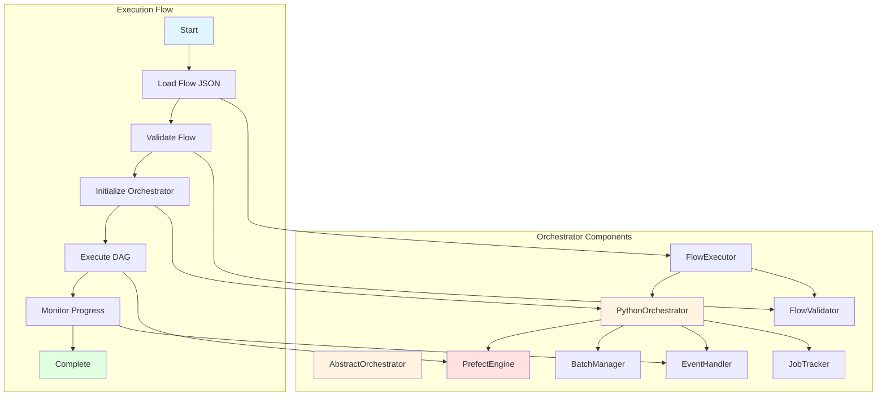
```mermaid
graph TB
    subgraph "Orchestrator Components"
        AO[AbstractOrchestrator]
        PO[PythonOrchestrator]
        FE[FlowExecutor]
        FV[FlowValidator]
        PE[PrefectEngine]
        BM[BatchManager]
        EH[EventHandler]
        JT[JobTracker]
    end
    
    subgraph "Execution Flow"
        START[Start] --> LOAD[Load Flow JSON]
        LOAD --> VALIDATE[Validate Flow]
        VALIDATE --> INIT[Initialize Orchestrator]
        INIT --> EXEC[Execute DAG]
        EXEC --> MONITOR[Monitor Progress]
        MONITOR --> COMPLETE[Complete]
    end
    
    FE --> FV
    FE --> PO
    PO --> PE
    PO --> BM
    PO --> EH
    PO --> JT
    
    LOAD --> FE
    VALIDATE --> FV
    INIT --> PO
    EXEC --> PE
    MONITOR --> EH

    style AO fill:#fff4e1
    style PO fill:#fff4e1
    style PE fill:#ffe1e1
    style START fill:#e1f5ff
    style COMPLETE fill:#e1ffe1
```

**Key Components:**

#### AbstractOrchestrator
- Base interface for all orchestrators
- Manages job lifecycle (initialization, execution, cleanup)
- Coordinates with Prefect engine
- Handles batch processing

#### Work Pool Configuration

The `WorkPoolConfig` model defines configuration for distributed execution modes:

```python
@dataclass
class WorkPoolConfig:
    enabled: bool = False
    type: str = "process"  # "process", "docker", "kubernetes"
    name: str = "default-pool"
    max_workers: Optional[int] = None
    image: Optional[str] = None
    namespace: Optional[str] = None
    batch_storage: Optional[BatchStorageConfig] = None
```

**Configuration Parameters:**

| Parameter | Type | Description | Required |
|-----------|------|-------------|----------|
| `enabled` | bool | Enable work pool execution | Yes |
| `type` | str | Execution type: "process", "docker", "kubernetes" | Yes |
| `name` | str | Work pool name in Prefect | Yes |
| `max_workers` | int | Maximum concurrent workers (process pool only) | No |
| `image` | str | Docker/Kubernetes / OpenShift image name | Docker/K8s |
| `namespace` | str | Kubernetes / OpenShift namespace | K8s only |
| `batch_storage` | object | Batch storage configuration | Docker/K8s |

**Batch Storage Configuration:**

```python
@dataclass
class BatchStorageConfig:
    type: str = "local"  # Only "local" supported
    base_path: str = "/tmp/datasift/batches"
```

**Configuration Examples:**

**Process Pool:**
```json
{
  "work_pool": {
    "enabled": true,
    "type": "process",
    "name": "datasift-process-pool",
    "max_workers": 4
  }
}
```

**Docker:**
```json
{
  "work_pool": {
    "enabled": true,
    "type": "docker",
    "name": "datasift-docker-pool",
    "image": "datasift:latest",
    "batch_storage": {
      "type": "local",
      "base_path": "/app/data/batches"
    }
  }
}
```

**Kubernetes / OpenShift:**
```json
{
  "work_pool": {
    "enabled": true,
    "type": "kubernetes",
    "name": "datasift-k8s-pool",
    "namespace": "datasift-production",
    "image": "myregistry.io/datasift:v1.0.0",
    "batch_storage": {
      "type": "local",
      "base_path": "/shared/batches"
    }
  }
}
```

**Work Pool Setup:**

Before using distributed execution, create the corresponding Prefect work pool:

```bash
# Process pool (managed automatically)
# No setup required

# Docker pool
prefect work-pool create datasift-docker-pool --type docker

# Kubernetes / OpenShift pool
prefect work-pool create datasift-k8s-pool --type kubernetes
```

**Worker Deployment:**

Start workers to process tasks from the work pool:

```bash
# Docker worker
prefect worker start --pool datasift-docker-pool

# Kubernetes / OpenShift worker (deployed as K8s Deployment)
kubectl apply -f k8s-deployment-examples/prefect-worker.yaml
```

- Tracks deleted rows and metadata

#### PythonOrchestrator
- Concrete implementation of [`AbstractOrchestrator`](src/datasift_opensource/backend/core/orchestrator/abstract_orchestrator.py)
- Used by both CLI and Python API
- Instantiated via [`OrchestratorFactory`](src/datasift_opensource/backend/core/orchestrator/orchestrator_factory.py)
- Manages operator execution through Prefect

#### FlowExecutor
- Entry point for flow execution
- Loads flow definitions from JSON files or dictionaries
- Validates flows before execution
- Manages memory diagnostics
- Handles cancellation requests

#### FlowValidator
- Validates operator configurations and parameters
- Checks data dependencies and DAG structure
- Verifies operator availability and compatibility
- Produces actionable errors and warnings

#### PrefectEngine
- Wraps Prefect workflow execution
- Manages task dependencies
- Handles parallel execution
- Provides retry logic
- Tracks execution state

#### BatchManager
- Coordinates batch processing
- Manages batch size configuration
- Handles batch splitting and merging
- Optimizes memory usage

### 2. Operator Base Classes

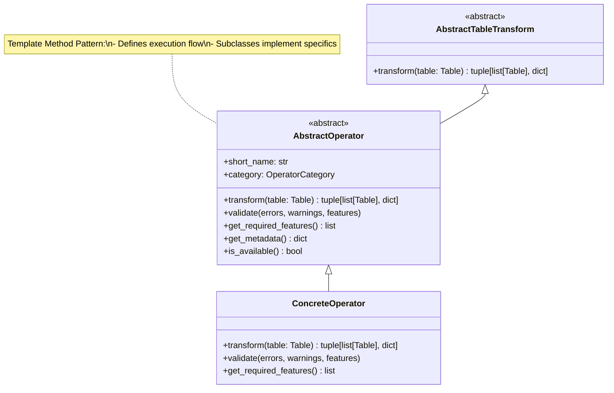
```mermaid
classDiagram
    class AbstractTableTransform {
        <<abstract>>
        +transform(table: Table) tuple[list[Table], dict]
    }
    
    class AbstractOperator {
        <<abstract>>
        +short_name: str
        +category: OperatorCategory
        +transform(table: Table) tuple[list[Table], dict]
        +validate(errors, warnings, features)
        +get_required_features() list
        +get_metadata() dict
        +is_available() bool
    }
    
    class ConcreteOperator {
        +transform(table: Table) tuple[list[Table], dict]
        +validate(errors, warnings, features)
        +get_required_features() list
    }
    
    AbstractTableTransform <|-- AbstractOperator
    AbstractOperator <|-- ConcreteOperator
    
    note for AbstractOperator "Template Method Pattern:\n- Defines execution flow\n- Subclasses implement specifics"
```

**AbstractOperator Responsibilities:**

1. **Configuration Management**: Parse and store operator parameters
2. **Validation**: Validate input data and configuration
3. **Execution**: Process PyArrow tables
4. **Metadata**: Track processing statistics
5. **Error Handling**: Record failed and skipped documents
6. **Feature Management**: Declare required input columns

### 3. Data Flow Between Operators

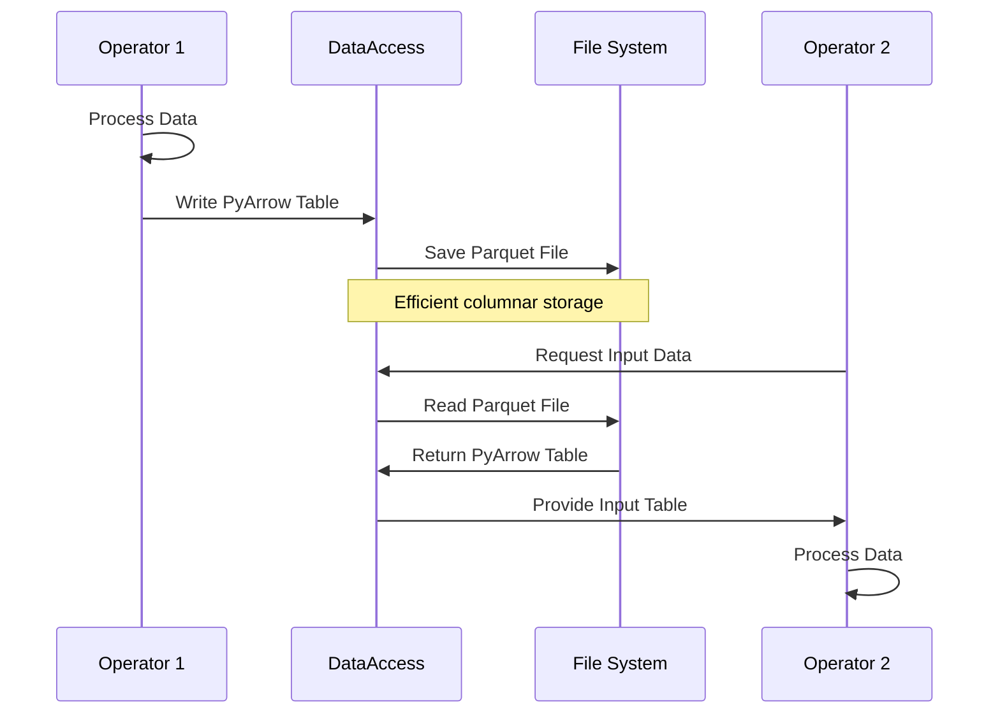
```mermaid
sequenceDiagram
    participant O1 as Operator 1
    participant DA as DataAccess
    participant FS as File System
    participant O2 as Operator 2
    
    O1->>O1: Process Data
    O1->>DA: Write PyArrow Table
    DA->>FS: Save Parquet File
    Note over DA,FS: Efficient columnar storage
    
    O2->>DA: Request Input Data
    DA->>FS: Read Parquet File
    FS->>DA: Return PyArrow Table
    DA->>O2: Provide Input Table
    O2->>O2: Process Data
```

**Key Features:**

1. **Schema Preservation**: Column schemas maintained across all operators
2. **Efficient Storage**: Columnar Parquet format for disk-based operations

**Processing Mechanisms:**

1. **In-Memory Passing**: Small datasets passed directly as PyArrow tables
2. **Disk-Based Storage**: Large datasets written to Parquet files for memory efficiency
3. **Batch Processing**: Large datasets split into configurable batches for parallel execution

### 4. Configuration Management

Configuration flows through multiple layers:

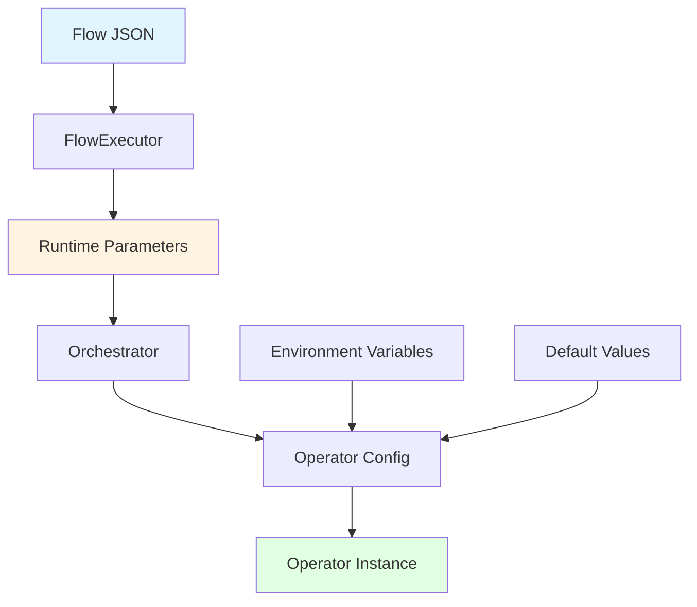
```mermaid
graph TD
    JSON[Flow JSON] --> FE[FlowExecutor]
    FE --> PARAMS[Runtime Parameters]
    PARAMS --> ORCH[Orchestrator]
    ORCH --> OP_CONFIG[Operator Config]
    OP_CONFIG --> OP[Operator Instance]
    
    ENV[Environment Variables] --> OP_CONFIG
    DEFAULTS[Default Values] --> OP_CONFIG
    
    style JSON fill:#e1f5ff
    style PARAMS fill:#fff4e1
    style OP fill:#e1ffe1
```

**Configuration Hierarchy:**
1. Flow JSON (base configuration)
2. Runtime parameters (override flow values)
3. Environment variables (system-level settings)
4. Default values (fallback configuration)

---
## Distributed Execution Architecture

Datasift-opensource supports multiple execution modes through a hexagonal architecture pattern that decouples the orchestration logic from the execution strategy. This enables seamless switching between local development and distributed production deployments.

### Execution Modes

The framework supports four execution modes:

1. **Thread Pool (Local Development)**: Uses Python's ThreadPoolExecutor for lightweight parallelism within a single process
2. **Process Pool (Single-Node Production)**: Uses Python's ProcessPoolExecutor for CPU-bound workloads on a single machine
3. **Docker (Distributed)**: Deploys batch processing tasks as Docker containers via Prefect work pools
4. **Kubernetes / OpenShift (Distributed)**: Orchestrates batch processing across Kubernetes / OpenShift pods for enterprise-scale deployments

### Hexagonal Architecture Pattern

The distributed execution system follows hexagonal architecture (ports and adapters) to maintain clean separation between business logic and infrastructure:

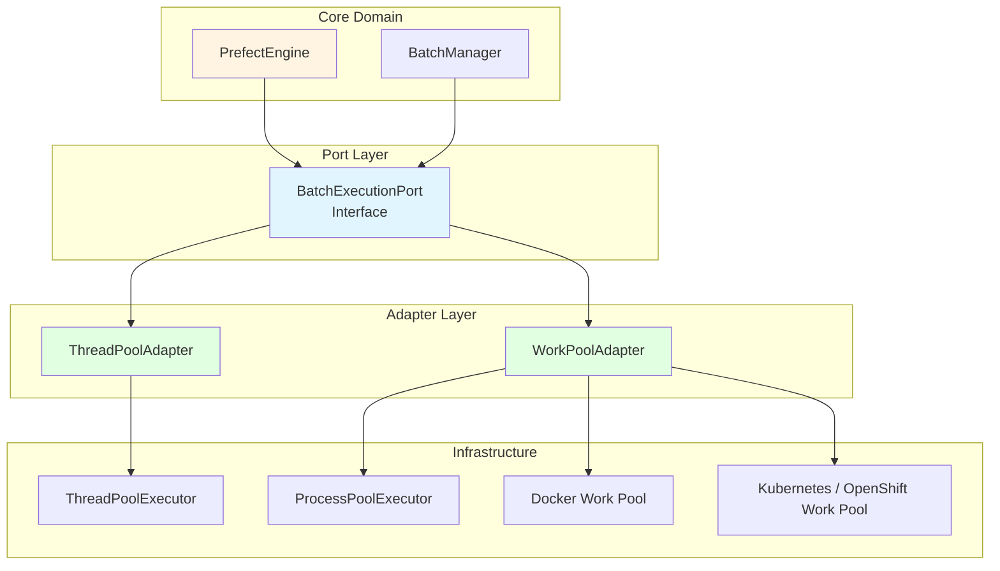
```mermaid
graph TB
    subgraph "Core Domain"
        PE[PrefectEngine]
        BM[BatchManager]
    end
    
    subgraph "Port Layer"
        BEP[BatchExecutionPort<br/>Interface]
    end
    
    subgraph "Adapter Layer"
        TPA[ThreadPoolAdapter]
        WPA[WorkPoolAdapter]
    end
    
    subgraph "Infrastructure"
        TP[ThreadPoolExecutor]
        PP[ProcessPoolExecutor]
        DW[Docker Work Pool]
        KW[Kubernetes / OpenShift Work Pool]
    end
    
    PE --> BEP
    BM --> BEP
    BEP --> TPA
    BEP --> WPA
    TPA --> TP
    WPA --> PP
    WPA --> DW
    WPA --> KW
    
    style PE fill:#fff4e1
    style BEP fill:#e1f5ff
    style TPA fill:#e1ffe1
    style WPA fill:#e1ffe1
```

**Key Components:**

#### BatchExecutionPort (Interface)
- Defines the contract for batch execution strategies
- Methods: `execute_batches()`, `shutdown()`
- Enables strategy pattern for execution modes

#### ThreadPoolAdapter
- Implements BatchExecutionPort for local execution
- Uses Python's ThreadPoolExecutor
- Best for I/O-bound operations and development
- No external infrastructure required

#### WorkPoolAdapter
- Implements BatchExecutionPort for distributed execution
- Supports process pool, Docker, and Kubernetes / OpenShift work pools
- Configurable via WorkPoolConfig
- Handles batch serialization and result aggregation

### Batch Storage Strategies

Distributed execution requires serializing batches for cross-process/container communication:

1. **Inline Storage**: Batches passed directly in memory (thread pool only)
2. **Local Filesystem**: Batches written to Parquet files on shared storage (process pool, Docker with volumes, Kubernetes / OpenShift with PVCs)

**Note:** S3 and other cloud storage backends are not currently supported.

### Execution Flow

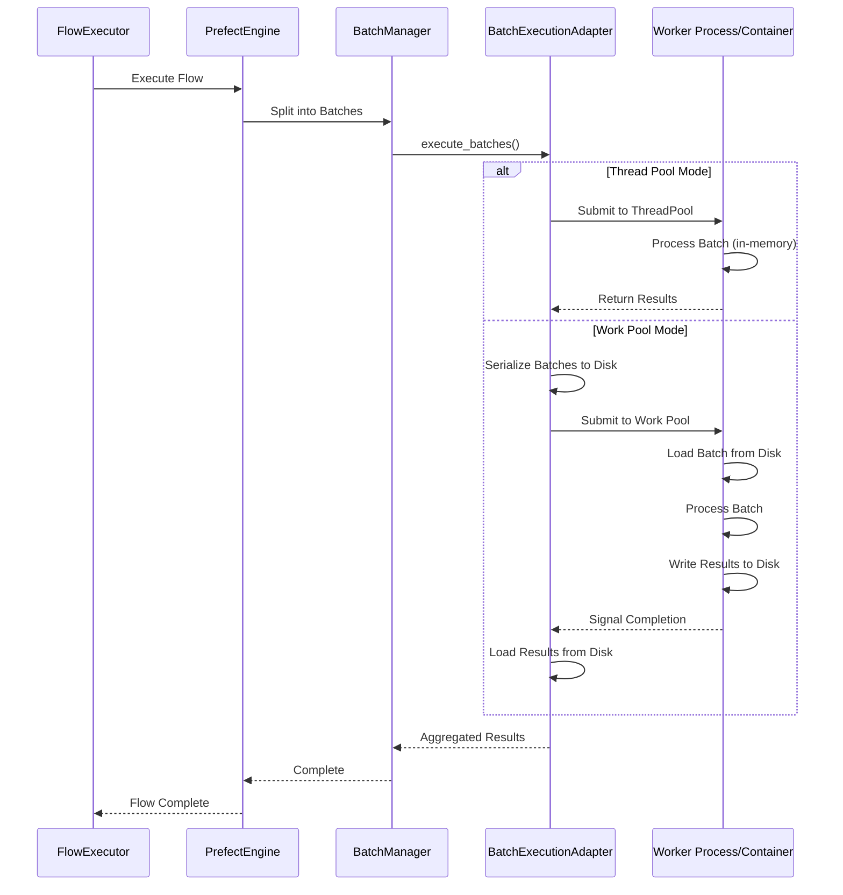
```mermaid
sequenceDiagram
    participant FE as FlowExecutor
    participant PE as PrefectEngine
    participant BM as BatchManager
    participant Adapter as BatchExecutionAdapter
    participant Worker as Worker Process/Container
    
    FE->>PE: Execute Flow
    PE->>BM: Split into Batches
    BM->>Adapter: execute_batches()
    
    alt Thread Pool Mode
        Adapter->>Worker: Submit to ThreadPool
        Worker->>Worker: Process Batch (in-memory)
        Worker-->>Adapter: Return Results
    else Work Pool Mode
        Adapter->>Adapter: Serialize Batches to Disk
        Adapter->>Worker: Submit to Work Pool
        Worker->>Worker: Load Batch from Disk
        Worker->>Worker: Process Batch
        Worker->>Worker: Write Results to Disk
        Worker-->>Adapter: Signal Completion
        Adapter->>Adapter: Load Results from Disk
    end
    
    Adapter-->>BM: Aggregated Results
    BM-->>PE: Complete
    PE-->>FE: Flow Complete
```

### Configuration

Execution mode is configured via the `work_pool` section in flow JSON:

**Thread Pool (Default):**
```json
{
  "work_pool": {
    "enabled": false
  }
}
```

**Process Pool:**
```json
{
  "work_pool": {
    "enabled": true,
    "type": "process",
    "name": "my-process-pool",
    "max_workers": 4
  }
}
```

**Docker:**
```json
{
  "work_pool": {
    "enabled": true,
    "type": "docker",
    "name": "my-docker-pool",
    "image": "datasift:latest",
    "batch_storage": {
      "type": "local",
      "base_path": "/shared/batches"
    }
  }
}
```

**Kubernetes / OpenShift:**
```json
{
  "work_pool": {
    "enabled": true,
    "type": "kubernetes",
    "name": "my-k8s-pool",
    "namespace": "datasift",
    "image": "datasift:latest",
    "batch_storage": {
      "type": "local",
      "base_path": "/shared/batches"
    }
  }
}
```

---


## Operator Lifecycle

### Complete Lifecycle Diagram

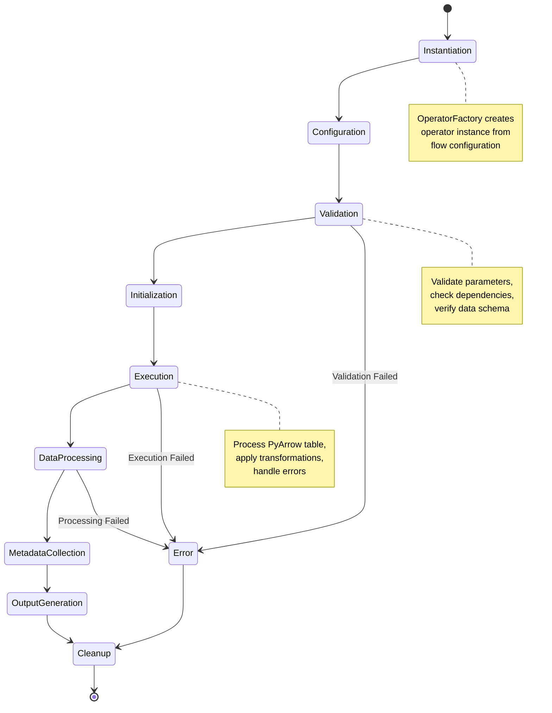
```mermaid
stateDiagram-v2
    [*] --> Instantiation
    Instantiation --> Configuration
    Configuration --> Validation
    Validation --> Initialization
    Initialization --> Execution
    Execution --> DataProcessing
    DataProcessing --> MetadataCollection
    MetadataCollection --> OutputGeneration
    OutputGeneration --> Cleanup
    Cleanup --> [*]
    
    Validation --> Error: Validation Failed
    Execution --> Error: Execution Failed
    DataProcessing --> Error: Processing Failed
    Error --> Cleanup
    
    note right of Instantiation
        OperatorFactory creates
        operator instance from
        flow configuration
    end note
    
    note right of Validation
        Validate parameters,
        check dependencies,
        verify data schema
    end note
    
    note right of Execution
        Process PyArrow table,
        apply transformations,
        handle errors
    end note
```

### Detailed Lifecycle Stages

#### 1. Instantiation

**Process:**
```python
# OperatorFactory creates operator from config
operator_class = import_operator_class(operator_type)
operator_instance = operator_class(config)
```

**Configuration Injection:**
- Operator type (fully qualified class name)
- Operator parameters (from flow JSON)
- Job metadata (job_id, job_run_id, context_id)
- Runtime parameters

#### 2. Configuration

**Operator receives:**
```python
config = {
    "name": "extract_1",
    "id": "extract_1",
    "job_id": "job_123",
    "job_run_id": "run_456",
    "operator_params": {
        "docling_url": "http://localhost:5000",
        "batch_size": 10
    }
}
```

**Parsed into operator attributes:**
- `self.name`: Operator name
- `self.id`: Unique operator ID
- `self.job_id`: Job identifier
- `self.job_run_id`: Job run identifier
- Custom parameters from `operator_params`

#### 3. Validation

**Two-Phase Validation:**

**Phase 1: Flow Validation (Pre-Execution)**
```python
def validate(self, errors: list, warnings: list, available_features: list):
    # Check required features exist
    OperatorUtils.validate_columns(
        available_features, 
        self.get_required_features(), 
        self.short_name, 
        errors
    )
    # Validate operator-specific parameters
    self._validate_params(errors, warnings)
```

**Phase 2: Runtime Validation (During Execution)**
- Input data schema validation
- Parameter value validation
- External service availability checks

#### 4. Execution

**Main execution flow:**

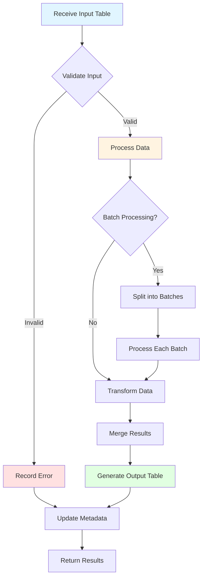
```mermaid
graph TD
    START[Receive Input Table] --> CHECK{Validate Input}
    CHECK -->|Valid| PROCESS[Process Data]
    CHECK -->|Invalid| ERROR[Record Error]
    
    PROCESS --> BATCH{Batch Processing?}
    BATCH -->|Yes| SPLIT[Split into Batches]
    BATCH -->|No| TRANSFORM[Transform Data]
    
    SPLIT --> LOOP[Process Each Batch]
    LOOP --> TRANSFORM
    TRANSFORM --> MERGE[Merge Results]
    MERGE --> OUTPUT[Generate Output Table]
    
    ERROR --> METADATA[Update Metadata]
    OUTPUT --> METADATA
    METADATA --> RETURN[Return Results]
    
    style START fill:#e1f5ff
    style PROCESS fill:#fff4e1
    style OUTPUT fill:#e1ffe1
    style ERROR fill:#ffe1e1
```

#### 5. Metadata Collection

**Metadata Structure:**
```python
metadata = {
    "total_docs": 100,
    "processed_docs": 95,
    "failed_docs_count": 3,
    "failed_docs": [
        {"id": "doc_1", "name": "file1.pdf", "reason": "Parse error"}
    ],
    "skipped_docs_count": 2,
    "skipped_docs": [
        {"id": "doc_3", "name": "file3.pdf", "reason": "Empty content"}
    ],
    "node_status": "COMPLETED"
}
```

---

## Data Flow Architecture

### End-to-End Data Flow

The platform supports multiple input sources and optional quality operators, but the core document-processing path is a linear sequence from ingestion through vector storage:

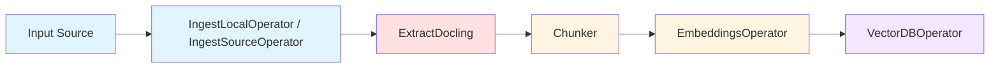
```mermaid
graph LR
    SRC[Input Source]
    ING[IngestLocalOperator / IngestSourceOperator]
    EXT[ExtractDocling]
    CHK[Chunker]
    EMB[EmbeddingsOperator]
    VDB[VectorDBOperator]

    SRC --> ING --> EXT --> CHK --> EMB --> VDB

    style SRC fill:#e1f5ff
    style ING fill:#e1f5ff
    style EXT fill:#ffe1e1
    style CHK fill:#fff4e1
    style EMB fill:#fff5e1
    style VDB fill:#f3e6ff
```

## Integration Patterns

### 1. Ollama Integration Architecture

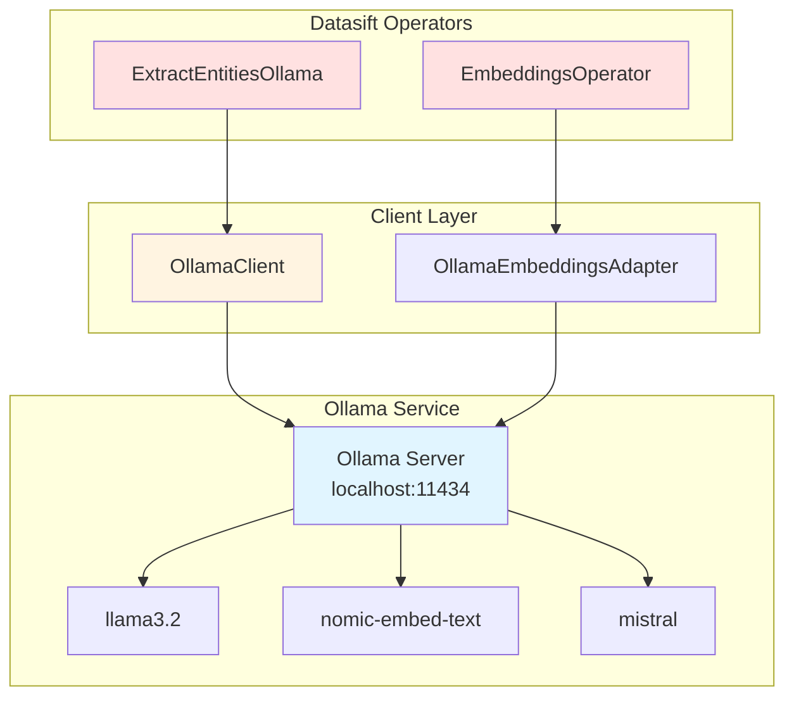
```mermaid
graph TB
    subgraph "Datasift Operators"
        EE[ExtractEntitiesOllama]
        EMB[EmbeddingsOperator]
    end
    
    subgraph "Client Layer"
        OC[OllamaClient]
        OEA[OllamaEmbeddingsAdapter]
    end
    
    subgraph "Ollama Service"
        OS[Ollama Server<br/>localhost:11434]
        M1[llama3.2]
        M2[nomic-embed-text]
        M3[mistral]
    end
    
    EE --> OC
    EMB --> OEA
    OC --> OS
    OEA --> OS
    OS --> M1
    OS --> M2
    OS --> M3
    
    style EE fill:#ffe1e1
    style EMB fill:#ffe1e1
    style OC fill:#fff4e1
    style OS fill:#e1f5ff
```

**Integration Points:**

1. **Entity Extraction**: Uses Ollama for LLM-based entity extraction
2. **Embeddings**: Generates vector embeddings using Ollama models
3. **Configuration**: Model selection, temperature, context window
4. **Error Handling**: Retry logic, timeout management

**Example Configuration:**
```json
{
  "operator": "extract_entities_ollama",
  "config": {
    "ollama_url": "http://localhost:11434",
    "model_name": "llama3.2",
    "temperature": 0.7,
    "max_tokens": 2000
  }
}
```

### 2. OpenSearch Integration Architecture

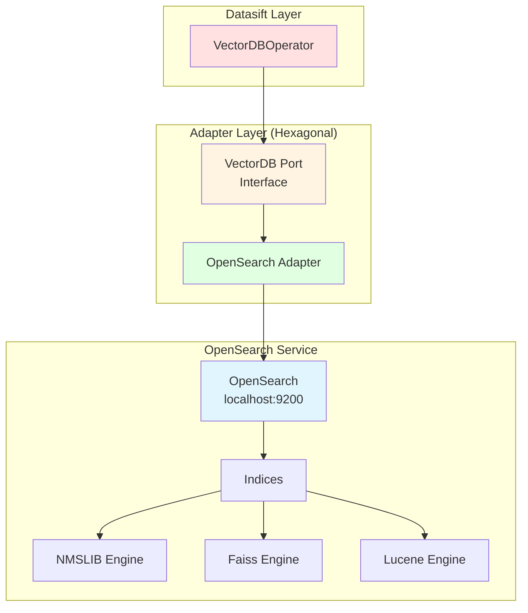
```mermaid
graph TB
    subgraph "Datasift Layer"
        VDB[VectorDBOperator]
    end
    
    subgraph "Adapter Layer (Hexagonal)"
        PORT[VectorDB Port<br/>Interface]
        OSA[OpenSearch Adapter]
    end
    
    subgraph "OpenSearch Service"
        OS[OpenSearch<br/>localhost:9200]
        IDX[Indices]
        KNN1[NMSLIB Engine]
        KNN2[Faiss Engine]
        KNN3[Lucene Engine]
    end
    
    VDB --> PORT
    PORT --> OSA
    OSA --> OS
    OS --> IDX
    IDX --> KNN1
    IDX --> KNN2
    IDX --> KNN3
    
    style VDB fill:#ffe1e1
    style PORT fill:#fff4e1
    style OSA fill:#e1ffe1
    style OS fill:#e1f5ff
```

**Hexagonal Architecture Benefits:**

1. **Decoupling**: VectorDBOperator independent of OpenSearch specifics
2. **Testability**: Easy to mock adapters for testing
3. **Extensibility**: Add new vector DB adapters without changing operator
4. **Flexibility**: Switch vector databases via configuration

**Supported KNN Engines:**
- **NMSLIB**: Fast approximate nearest neighbor search
- **Faiss**: Facebook's similarity search library
- **Lucene**: Native Lucene KNN implementation

**Example Configuration:**
```json
{
  "operator": "vectordb",
  "config": {
    "vector_db_type": "opensearch",
    "index_name": "documents",
    "vector_dimension": 768,
    "vectordb_parameters": {
      "host": "localhost",
      "port": 9200,
      "engine": "nmslib",
      "space_type": "cosinesimil"
    }
  }
}
```

### 3. Docling Integration Architecture

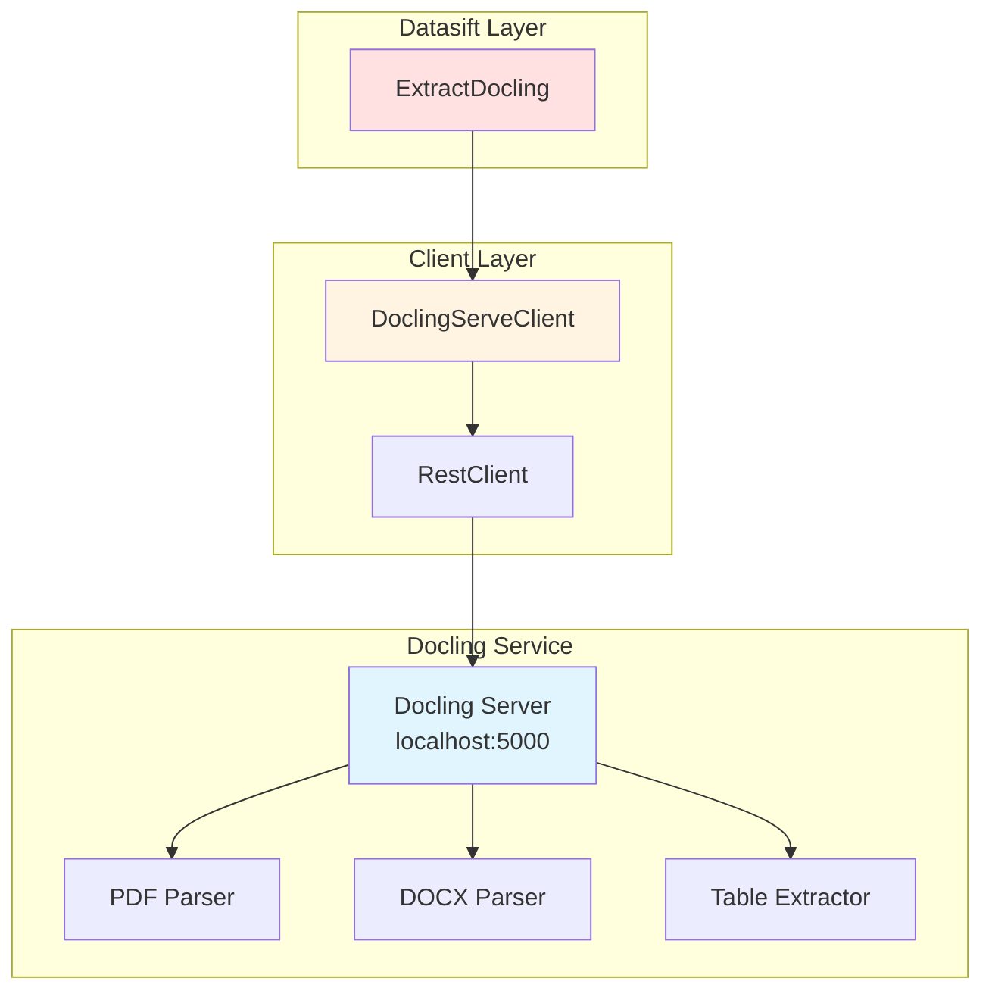
```mermaid
graph TB
    subgraph "Datasift Layer"
        ED[ExtractDocling]
    end
    
    subgraph "Client Layer"
        DC[DoclingServeClient]
        RC[RestClient]
    end
    
    subgraph "Docling Service"
        DS[Docling Server<br/>localhost:5000]
        PDF[PDF Parser]
        DOCX[DOCX Parser]
        TABLE[Table Extractor]
    end
    
    ED --> DC
    DC --> RC
    RC --> DS
    DS --> PDF
    DS --> DOCX
    DS --> TABLE
    
    style ED fill:#ffe1e1
    style DC fill:#fff4e1
    style DS fill:#e1f5ff
```

**Integration Features:**

1. **Document Parsing**: Extract text and structure from PDFs, DOCX
2. **Table Extraction**: Identify and extract tables with structure
3. **Metadata Extraction**: Document properties, page count, etc.
4. **Batch Processing**: Process multiple documents efficiently

**Example Configuration:**
```json
{
  "operator": "extract_docling",
  "config": {
    "doc_column": "content",
    "extract_tables": true,
    "extract_images": false
  }
}
```

### 4. DocumentClassifier Pattern

The DocumentClassifier operator is typically used **before** Extract operators to classify documents into predefined categories. This enables downstream operators to handle different document types appropriately.

**Typical Workflow Position:**

```mermaid
graph LR
    A[Ingest] --> B[DocumentClassifier]
    B --> C[Extract]
    C --> D[Chunk]
    D --> E[Embed]
    E --> F[VectorDB]
    
    style A fill:#e1f5ff
    style B fill:#e6ffe6
    style C fill:#ffe1f5
    style D fill:#f5ffe1
    style E fill:#fff5e1
    style F fill:#e1fff5
```

**Classification Features:**

1. **Pre-Extraction Classification**: Classifies documents before content extraction
2. **Multi-Class Support**: Supports multiple document classes (invoices, contracts, forms, etc.)
3. **Confidence Scoring**: Provides classification confidence scores
4. **Metadata Enrichment**: Adds classification results to document metadata

**Example Configuration:**
```json
{
  "operator_type": "DocumentClassifier",
  "operator_params": {
    "model_path": "path/to/classifier/model",
    "confidence_threshold": 0.7,
    "document_classes": [
      "invoice",
      "contract",
      "receipt",
      "form"
    ]
  }
}
```

**Use Cases:**
- Route documents to specialized extraction pipelines based on type
- Filter documents by category before expensive processing
- Enrich metadata with document type information
- Enable type-specific chunking or embedding strategies

### 5. External Service Pattern

**Common Pattern for All Integrations:**

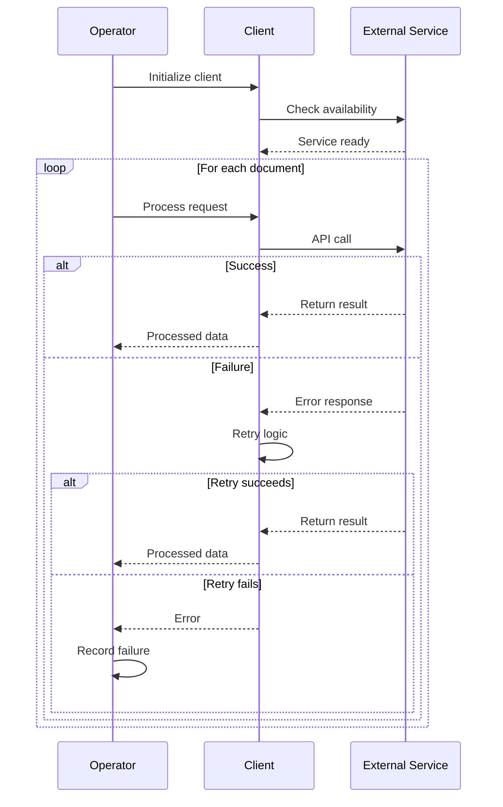
```mermaid
sequenceDiagram
    participant OP as Operator
    participant CL as Client
    participant SVC as External Service
    
    OP->>CL: Initialize client
    CL->>SVC: Check availability
    SVC-->>CL: Service ready
    
    loop For each document
        OP->>CL: Process request
        CL->>SVC: API call
        alt Success
            SVC-->>CL: Return result
            CL-->>OP: Processed data
        else Failure
            SVC-->>CL: Error response
            CL->>CL: Retry logic
            alt Retry succeeds
                SVC-->>CL: Return result
                CL-->>OP: Processed data
            else Retry fails
                CL-->>OP: Error
                OP->>OP: Record failure
            end
        end
    end
```

**Client Responsibilities:**
1. Connection management
2. Request/response handling
3. Retry logic with exponential backoff
4. Error handling and logging
5. Timeout management

### 6. IngestSource Multi-Provider Pattern

The IngestSource operator provides a unified interface for ingesting documents from multiple storage providers and data sources. It uses an adapter-based architecture for extensibility and supports both LangChain loaders and custom adapters.

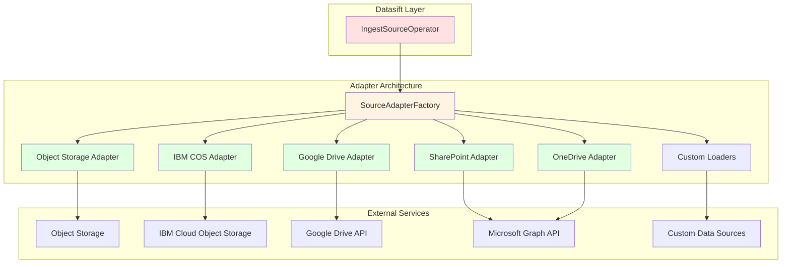
```mermaid
graph TB
    subgraph "Datasift Layer"
        ISO[IngestSourceOperator]
    end
    
    subgraph "Adapter Architecture"
        SAF[SourceAdapterFactory]
        OBJA[Object Storage Adapter]
        IBMA[IBM COS Adapter]
        GDA[Google Drive Adapter]
        SPA[SharePoint Adapter]
        ODA[OneDrive Adapter]
        CUST[Custom Loaders]
    end
    
    subgraph "External Services"
        OBJ[Object Storage]
        IBM[IBM Cloud Object Storage]
        GD[Google Drive API]
        MS[Microsoft Graph API]
        CUSTOM[Custom Data Sources]
    end
    
    ISO --> SAF
    SAF --> OBJA
    SAF --> IBMA
    SAF --> GDA
    SAF --> SPA
    SAF --> ODA
    SAF --> CUST
    
    OBJA --> OBJ
    IBMA --> IBM
    GDA --> GD
    SPA --> MS
    ODA --> MS
    CUST --> CUSTOM
    
    style ISO fill:#ffe1e1
    style SAF fill:#fff4e1
    style OBJA fill:#e1ffe1
    style IBMA fill:#e1ffe1
    style GDA fill:#e1ffe1
    style SPA fill:#e1ffe1
    style ODA fill:#e1ffe1
```

**Supported Providers:**

1. **Object Storage**: S3-compatible object storage
   - Bucket-based access
   - Prefix-based filtering
   - Binary content download via boto3

2. **IBM Cloud Object Storage (COS)**: IBM's S3-compatible storage
   - Custom endpoint configuration
   - S3-compatible API
   - Enterprise-grade storage

3. **Microsoft SharePoint**: Document management and collaboration
   - Microsoft Graph API integration
   - App-only (client credentials) authentication
   - Drive and folder-based access
   - Recursive directory traversal

4. **Microsoft OneDrive**: Personal and business cloud storage
   - Microsoft Graph API integration
   - Same authentication as SharePoint
   - Personal and shared drives support

5. **Google Drive**: Google's cloud storage service
   - OAuth2 authentication
   - Service account support
   - Folder hierarchy navigation
   - Shared drive access

6. **Custom Loaders**: Extensible loader framework
   - Dynamic loader import
   - LangChain-compatible interface
   - Provider-specific implementations

**Architecture Features:**

1. **Adapter Pattern**: Decouples operator from provider-specific implementations
2. **Factory Pattern**: Automatic adapter selection based on provider name
3. **Async Support**: Efficient document fetching with async/await
4. **Binary Content Handling**: Pre-fetches binary content for downstream processing
5. **Incremental Updates**: Tracks processed documents to avoid re-ingestion
6. **Metadata Enrichment**: Extracts file metadata (size, modified time, mimetype)

**Configuration Examples:**

**Object Storage:**
```json
{
  "operator_type": "IngestSourceOperator",
  "operator_params": {
    "provider": "s3",
    "connection_params": {
      "bucket": "my-documents",
      "prefix": "invoices/"
    },
    "credentials": {
      "access_key": "your-access-key",  # pragma: allowlist secret
      "secret_key": "your-secret-key"  # pragma: allowlist secret
    },
    "max_files": 100,
    "include_filter": ".pdf,.docx",
    "ignore_hidden_files": true
  }
}
```

**IBM Cloud Object Storage:**
```json
{
  "operator_type": "IngestSourceOperator",
  "operator_params": {
    "provider": "ibm_cos",
    "connection_params": {
      "bucket": "enterprise-docs",
      "endpoint_url": "https://s3.us-south.cloud-object-storage.appdomain.cloud",
      "prefix": "contracts/"
    },
    "credentials": {
      "access_key": "your-access-key",  # pragma: allowlist secret
      "secret_key": "your-secret-key"  # pragma: allowlist secret
    },
    "max_files": 500
  }
}
```

**Microsoft SharePoint:**
```json
{
  "operator_type": "IngestSourceOperator",
  "operator_params": {
    "provider": "sharepoint",
    "connection_params": {
      "drive_id": "b!abc123...",
      "folder_path": "/Shared Documents/Projects",
      "recursive": true
    },
    "credentials": {
      "client_id": "your-app-client-id",
      "client_secret": "your-app-secret",  # pragma: allowlist secret
      "tenant_id": "your-tenant-id"
    },
    "include_filter": ".pdf,.docx,.xlsx",
    "max_files": 200
  }
}
```

**Microsoft OneDrive:**
```json
{
  "operator_type": "IngestSourceOperator",
  "operator_params": {
    "provider": "onedrive",
    "connection_params": {
      "drive_id": "b!xyz789...",
      "folder_path": "/Documents/Reports",
      "recursive": false
    },
    "credentials": {
      "client_id": "your-app-client-id",
      "client_secret": "your-app-secret",  # pragma: allowlist secret
      "tenant_id": "your-tenant-id"
    },
    "exclude_filter": ".tmp,.bak"
  }
}
```

**Google Drive:**
```json
{
  "operator_type": "IngestSourceOperator",
  "operator_params": {
    "provider": "google_drive",
    "connection_params": {
      "folder_id": "1a2b3c4d5e6f7g8h9i0j",
      "recursive": true
    },
    "credentials": {
      "service_account_key": "/path/to/service-account-key.json"
    },
    "max_files": 150
  }
}
```

**Key Features:**

1. **Authentication Methods**:
   - Access key credentials (object storage, IBM COS)
   - OAuth2 client credentials (SharePoint, OneDrive)
   - Service account keys (Google Drive)
   - Custom authentication for extensible loaders

2. **Filtering Capabilities**:
   - Extension-based include/exclude filters
   - Hidden file filtering (files starting with '.')
   - Prefix-based path filtering
   - Maximum file count limits

3. **Metadata Extraction**:
   - File name, size, and modified time
   - MIME type and file extension
   - Source URL and unique identifiers
   - Provider-specific metadata

4. **Binary Content Handling**:
   - Pre-fetches binary content for downstream operators
   - Efficient memory management
   - Fallback to text content when binary unavailable
   - Compatible with ExtractDocling and other extract operators

5. **Incremental Processing**:
   - Tracks previously processed documents
   - Skips unchanged files on subsequent runs
   - Force re-ingestion option available
   - Job-based tracking for multi-run workflows

**Use Cases:**

1. **Multi-Source Document Ingestion**: Ingest documents from multiple storage providers in a single pipeline
2. **Enterprise Content Migration**: Migrate documents from SharePoint/OneDrive to vector databases
3. **Compliance Document Processing**: Process regulatory documents from object storage or IBM COS with audit trails
4. **Knowledge Base Construction**: Build searchable knowledge bases from Google Drive folders
5. **Hybrid Workflows**: Combine on-premises and cloud storage sources
6. **Incremental Updates**: Efficiently process only new or modified documents

**Integration with Other Operators:**

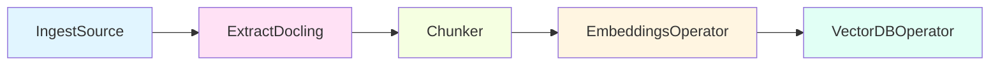
```mermaid
graph LR
    A[IngestSource] --> B[ExtractDocling]
    B --> C[Chunker]
    C --> D[EmbeddingsOperator]
    D --> E[VectorDBOperator]
    
    style A fill:#e1f5ff
    style B fill:#ffe1f5
    style C fill:#f5ffe1
    style D fill:#fff5e1
    style E fill:#e1fff5
```

**Typical Pipeline:**
1. **IngestSource**: Load documents from cloud storage
2. **ExtractDocling**: Extract structured content from binary files
3. **Chunker**: Split documents into manageable chunks
4. **EmbeddingsOperator**: Generate vector embeddings
5. **VectorDBOperator**: Store in OpenSearch or other vector databases

---
## Deployment Patterns

Datasift-opensource supports multiple deployment patterns to accommodate different operational requirements, from local development to enterprise-scale production deployments.

### 1. Local Development (ThreadPoolAdapter)

**Use Case:** Development, testing, and small-scale processing

**Architecture:**
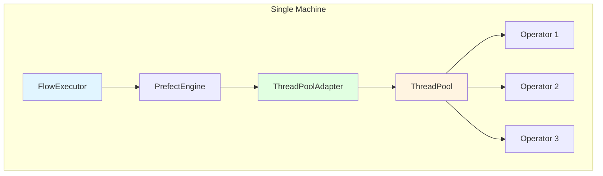
```mermaid
graph TB
    subgraph "Single Machine"
        FE[FlowExecutor]
        PE[PrefectEngine]
        TPA[ThreadPoolAdapter]
        TP[ThreadPool]
        OP1[Operator 1]
        OP2[Operator 2]
        OP3[Operator 3]
    end
    
    FE --> PE
    PE --> TPA
    TPA --> TP
    TP --> OP1
    TP --> OP2
    TP --> OP3
    
    style FE fill:#e1f5ff
    style TPA fill:#e1ffe1
    style TP fill:#fff4e1
```

**Configuration:**
```json
{
  "work_pool": {
    "enabled": false
  }
}
```

**Characteristics:**
- No external infrastructure required
- In-memory batch passing
- Fast startup and iteration
- Limited to single machine resources
- Ideal for I/O-bound operations

**Setup:**
```bash
# No additional setup required
datasift-orchestrator --flow-file my-flow.json
```

---

### 2. Production Single-Node (ProcessPoolAdapter)

**Use Case:** CPU-intensive workloads on a single powerful machine

**Architecture:**
```mermaid
graph TB
    subgraph "Single Machine"
        FE[FlowExecutor]
        PE[PrefectEngine]
        WPA[WorkPoolAdapter]
        PP[ProcessPool]
        
        subgraph "Worker Processes"
            P1[Process 1]
            P2[Process 2]
            P3[Process 3]
            P4[Process 4]
        end
        
        FS[Local Filesystem<br/>Batch Storage]
    end
    
    FE --> PE
    PE --> WPA
    WPA --> PP
    PP --> P1
    PP --> P2
    PP --> P3
    PP --> P4
    
    WPA -.->|Write Batches| FS
    P1 -.->|Read/Write| FS
    P2 -.->|Read/Write| FS
    P3 -.->|Read/Write| FS
    P4 -.->|Read/Write| FS
    
    style FE fill:#e1f5ff
    style WPA fill:#e1ffe1
    style PP fill:#fff4e1
    style FS fill:#ffe1e1
```

**Configuration:**
```json
{
  "work_pool": {
    "enabled": true,
    "type": "process",
    "name": "datasift-process-pool",
    "max_workers": 4
  }
}
```

**Characteristics:**
- True parallel processing with separate Python processes
- Bypasses GIL limitations
- Disk-based batch storage
- Scales to machine CPU cores
- Better for CPU-bound operations

**Setup:**
```bash
# Process pool is managed automatically
datasift-orchestrator --flow-file my-flow.json
```

---

### 3. Production Distributed Docker (WorkPoolAdapter + Docker)

**Use Case:** Containerized deployments with horizontal scaling

**Architecture:**
```mermaid
graph TB
    subgraph "Control Node"
        FE[FlowExecutor]
        PE[PrefectEngine]
        WPA[WorkPoolAdapter]
        PS[Prefect Server]
    end
    
    subgraph "Shared Storage"
        VOL[Docker Volume<br/>Batch Storage]
    end
    
    subgraph "Worker Nodes"
        W1[Docker Worker 1]
        W2[Docker Worker 2]
        W3[Docker Worker 3]
    end
    
    FE --> PE
    PE --> WPA
    WPA --> PS
    PS --> W1
    PS --> W2
    PS --> W3
    
    WPA -.->|Write Batches| VOL
    W1 -.->|Read/Write| VOL
    W2 -.->|Read/Write| VOL
    W3 -.->|Read/Write| VOL
    
    style FE fill:#e1f5ff
    style WPA fill:#e1ffe1
    style PS fill:#fff4e1
    style VOL fill:#ffe1e1
```

**Configuration:**
```json
{
  "work_pool": {
    "enabled": true,
    "type": "docker",
    "name": "datasift-docker-pool",
    "image": "datasift:latest",
    "batch_storage": {
      "type": "local",
      "base_path": "/app/data/batches"
    }
  }
}
```

**Characteristics:**
- Containerized execution environment
- Horizontal scaling across multiple hosts
- Shared volume for batch storage
- Consistent runtime environment
- Easy deployment and rollback

**Setup:**

1. **Build Docker Image:**
```bash
docker build -t datasift:latest -f docker/Dockerfile .
```

2. **Create Work Pool:**
```bash
prefect work-pool create datasift-docker-pool --type docker
```

3. **Start Workers:**
```bash
# Using Docker Compose
docker-compose -f docker/docker-compose.worker.yml up -d

# Or manually
docker run -d \
  -v datasift-batches:/app/data/batches \
  datasift:latest \
  prefect worker start --pool datasift-docker-pool
```

4. **Execute Flow:**
```bash
datasift-orchestrator --flow-file my-flow.json
```

**Docker Compose Example:**
```yaml
version: '3.8'
services:
  worker:
    image: datasift:latest
    command: prefect worker start --pool datasift-docker-pool
    volumes:
      - datasift-batches:/app/data/batches
    environment:
      - PREFECT_API_URL=http://prefect-server:4200/api
    deploy:
      replicas: 3

volumes:
  datasift-batches:
```

---

### 4. Production Distributed Kubernetes / OpenShift (WorkPoolAdapter + Kubernetes / OpenShift)

**Use Case:** Enterprise-scale deployments with auto-scaling and high availability

**Architecture:**
```mermaid
graph TB
    subgraph "Control Plane"
        FE[FlowExecutor]
        PE[PrefectEngine]
        WPA[WorkPoolAdapter]
        PS[Prefect Server]
    end
    
    subgraph "Kubernetes / OpenShift Cluster"
        subgraph "Shared Storage"
            PVC[PersistentVolumeClaim<br/>Batch Storage]
        end
        
        subgraph "Worker Pods"
            POD1[Worker Pod 1]
            POD2[Worker Pod 2]
            POD3[Worker Pod 3]
            PODN[Worker Pod N]
        end
        
        HPA[HorizontalPodAutoscaler]
    end
    
    FE --> PE
    PE --> WPA
    WPA --> PS
    PS --> POD1
    PS --> POD2
    PS --> POD3
    PS --> PODN
    
    HPA -.->|Scale| Worker Pods
    
    WPA -.->|Write Batches| PVC
    POD1 -.->|Read/Write| PVC
    POD2 -.->|Read/Write| PVC
    POD3 -.->|Read/Write| PVC
    PODN -.->|Read/Write| PVC
    
    style FE fill:#e1f5ff
    style WPA fill:#e1ffe1
    style PS fill:#fff4e1
    style PVC fill:#ffe1e1
```

**Configuration:**
```json
{
  "work_pool": {
    "enabled": true,
    "type": "kubernetes",
    "name": "datasift-k8s-pool",
    "namespace": "datasift-production",
    "image": "myregistry.io/datasift:v1.0.0",
    "batch_storage": {
      "type": "local",
      "base_path": "/shared/batches"
    }
  }
}
```

**Characteristics:**
- Enterprise-grade orchestration
- Auto-scaling based on workload
- High availability and fault tolerance
- Resource isolation and limits
- Multi-tenant support
- Rolling updates and rollbacks

**Setup:**

1. **Create Namespace:**
```bash
kubectl create namespace datasift-production
```

2. **Deploy Persistent Volume:**
```bash
kubectl apply -f k8s-deployment-examples/persistent-volume.yaml
```

3. **Create Work Pool:**
```bash
prefect work-pool create datasift-k8s-pool --type kubernetes
```

4. **Deploy Workers:**
```bash
kubectl apply -f k8s-deployment-examples/prefect-worker.yaml
```

5. **Execute Flow:**
```bash
datasift-orchestrator --flow-file my-flow.json
```

**Kubernetes / OpenShift Manifests:**

See `k8s-deployment-examples/` directory for complete manifests:
- `persistent-volume.yaml`: Shared storage for batches
- `prefect-worker.yaml`: Worker deployment with auto-scaling
- `configmap.yaml`: Configuration management
- `secrets.yaml`: Credentials management

**Resource Requirements:**
- **CPU**: 2-4 cores per worker pod
- **Memory**: 4-8 GB per worker pod
- **Storage**: 50-100 GB shared PVC for batch storage

---

### Deployment Pattern Comparison

| Pattern | Complexity | Scalability | Cost | Use Case |
|---------|-----------|-------------|------|----------|
| **Thread Pool** | Low | Single machine | Minimal | Development, testing |
| **Process Pool** | Low | Single machine | Low | Single-node production |
| **Docker** | Medium | Horizontal | Medium | Multi-host deployments |
| **Kubernetes / OpenShift** | High | Auto-scaling | Higher | Enterprise production |

### Choosing a Deployment Pattern

**Use Thread Pool when:**
- Developing and testing flows
- Processing small datasets (<1000 documents)
- Running on a laptop or workstation
- I/O-bound operations dominate

**Use Process Pool when:**
- Running CPU-intensive operations
- Single powerful machine available
- Simple deployment preferred
- Dataset fits on one machine

**Use Docker when:**
- Need containerized deployments
- Scaling across multiple hosts
- Consistent runtime environment required
- Docker infrastructure already available

**Use Kubernetes / OpenShift when:**
- Enterprise-scale deployments
- Auto-scaling required
- High availability needed
- Multi-tenant environments
- Advanced orchestration features required

---


## Design Decisions

### 1. Why PyArrow Tables?

**Decision:** Use PyArrow as the primary data interchange format.

**Rationale:**

| Aspect | Benefit |
|--------|---------|
| **Memory Efficiency** | Columnar format reduces memory footprint by 50-70% |
| **Performance** | Zero-copy reads, fast serialization (10-100x faster than JSON) |
| **Interoperability** | Works with Pandas, Polars, DuckDB, Spark |
| **Schema Enforcement** | Strong typing prevents data quality issues |
| **Scalability** | Handles datasets from KB to TB efficiently |
| **Parquet Support** | Native integration with Parquet file format |

### 2. Why Prefect for Orchestration?

**Decision:** Use Prefect as the workflow orchestration engine.

**Rationale:**

| Feature | Benefit |
|---------|---------|
| **DAG Support** | Native directed acyclic graph execution |
| **Parallel Execution** | Automatic parallelization of independent tasks |
| **Error Handling** | Built-in retry logic and error recovery |
| **Monitoring** | Real-time execution monitoring and logging |
| **Python-Native** | Pure Python, no external DSL required |
| **Local Execution** | Runs locally without external infrastructure |

### 3. Why Operator-Based Architecture?

**Decision:** Build the framework around composable operators.

**Rationale:**

| Principle | Benefit |
|-----------|---------|
| **Modularity** | Each operator is self-contained and testable |
| **Reusability** | Operators can be reused across different flows |
| **Extensibility** | Easy to add new operators without changing core |
| **Composability** | Complex pipelines built from simple operators |
| **Maintainability** | Changes isolated to individual operators |
| **Testability** | Unit test operators independently |

**Design Pattern:** Template Method + Strategy Pattern

### 4. Extensibility Considerations

**Design for Extension:**

1. **Abstract Base Classes**: Clear contracts for new operators
2. **Factory Pattern**: Centralized operator instantiation
3. **Configuration-Driven**: Operators configured via JSON
4. **Hexagonal Architecture**: External services via adapters
5. **Plugin Discovery**: Automatic operator registration

**Extension Points:**

```mermaid
graph TD
    EXT[Extension Points]
    EXT --> OP[New Operators]
    EXT --> ADAPT[New Adapters]
    EXT --> ORCH[Custom Orchestrators]
    EXT --> VAL[Custom Validators]
    
    OP --> IMPL1[Inherit AbstractOperator]
    OP --> IMPL2[Implement transform]
    OP --> IMPL3[Register in factory]
    
    ADAPT --> IMPL4[Implement adapter interface]
    ADAPT --> IMPL5[Register in VectorDBOperator]
    
    style EXT fill:#e1f5ff
    style OP fill:#ffe1e1
    style ADAPT fill:#fff4e1
```

**Example: Adding a New Operator**

```python
from core.operators.abstract_operator import AbstractOperator, OperatorCategory

class MyCustomOperator(AbstractOperator):
    short_name = "my_custom"
    category = OperatorCategory.Functional
    
    def __init__(self, config: dict):
        super().__init__(config)
        self.custom_param = config.get("custom_param")
    
    def transform(self, table: pa.Table) -> tuple[list[pa.Table], dict[str, Any]]:
        # Implementation
        metadata = self.create_base_metadata(total_docs_count=len(table))
        # Process table
        return [output_table], metadata
    
    def get_required_features(self) -> list:
        return ["doc_id", "content"]
```

### Schema Evolution

```mermaid
graph LR
    S1[Initial Schema] --> S2[After Extract]
    S2 --> S3[After Chunk]
    S3 --> S4[After Embed]
    
    S1 -.->|doc_id, doc_name,<br/>file_path| S1
    S2 -.->|+ content, tables,<br/>metadata| S2
    S3 -.->|+ chunks, chunk_ids| S3
    S4 -.->|+ embeddings| S4
    
    style S1 fill:#ffe1e1
    style S2 fill:#fff4e1
    style S3 fill:#e1ffe1
    style S4 fill:#e1f5ff
```

**Schema Transformation Example:**

**After Ingest:**
```
doc_id: string
doc_name: string
file_path: string
file_size: int64
```

**After Extract:**
```
doc_id: string
doc_name: string
file_path: string
file_size: int64
content: string          # NEW
tables: list<struct>     # NEW
metadata: struct         # NEW
```

**After Chunk:**
```
doc_id: string
doc_name: string
content: string
chunk_id: string         # NEW
chunk_text: string       # NEW
chunk_index: int32       # NEW
```

**After Embed:**
```
doc_id: string
doc_name: string
chunk_id: string
chunk_text: string
embeddings: list<float>  # NEW
```

---

**Why PyArrow?**

- **Memory Efficiency**: Columnar format with zero-copy reads
- **Interoperability**: Standard format across data tools (Pandas, Polars, DuckDB)
- **Performance**: Fast serialization/deserialization
- **Schema Enforcement**: Strong typing with schema validation
- **Scalability**: Handles large datasets efficiently
- **Parquet Integration**: Native support for Parquet file format

**Data Flow Pattern:**
```
Operator Input (PyArrow Table) 
    → Processing Logic 
    → Operator Output (PyArrow Table)
```

---

- Perform entity extraction, semantic chunking, and embedding generation at scale

## Repository Structure

```
datasift/
├── src/datasift_opensource/          # Main source code
│   ├── backend/                      # Backend components
│   │   ├── app/                      # Backend API application
│   │   ├── cli/                      # CLI implementation
│   │   ├── common/                   # Shared utilities and models
│   │   │   ├── clients/              # LLM client abstractions
│   │   │   ├── constants/            # Constants and enums
│   │   │   ├── document_classes/     # 40+ document class schemas
│   │   │   ├── exceptions/           # Exception hierarchy with error codes
│   │   │   ├── models/               # Data models
│   │   │   └── util/                 # Utility functions
│   │   │       ├── core/             # Core utilities (strings, validation, etc.)
│   │   │       ├── data/             # Data handling utilities
│   │   │       ├── infrastructure/   # Infrastructure utilities
│   │   │       ├── job_tracker/      # Job tracking and statistics
│   │   │       ├── operators/        # Operator utilities
│   │   │       └── orchestration/    # Orchestration utilities
│   │   ├── core/                     # Core orchestration framework
│   │   │   ├── data_access/          # Data access abstractions
│   │   │   ├── operators/            # Operator implementations
│   │   │   │   ├── extract/          # Extract operators
│   │   │   │   ├── functional/       # Functional operators
│   │   │   │   ├── ingest/           # Ingest operators
│   │   │   │   ├── quality/          # Quality/filtering operators
│   │   │   │   └── vectordb/         # Vector database operators
│   │   │   └── orchestrator/         # Orchestration components
│   │   │       ├── cmdline/          # Command-line executor
│   │   │       ├── prefect/          # Prefect orchestration module
│   │   │       │   ├── adapters/     # Batch execution adapters
│   │   │       │   ├── config/       # Work pool configuration
│   │   │       │   ├── domain/       # Domain models
│   │   │       │   └── ports/        # Batch execution port
│   │   │       └── python/           # Python orchestrator
│   │   └── models/                   # ML models (FastText, etc.)
│   └── ui/                           # User interface components
├── tests/                            # Test suites
│   ├── unit/                         # Unit tests
│   ├── integration/                  # Integration tests
│   └── fixtures/                     # Test fixtures
├── docs/                             # Documentation
├── examples/                         # Example flows and configurations
└── pyproject.toml                    # Project configuration
```

## Core Components

### 1. Common Utilities (`src/datasift_opensource/backend/common/`)

#### Clients (`common/clients/`)
- **LLM Client Abstractions**: Base interfaces for LLM providers
- **Ollama Client**: Integration with Ollama for local LLM operations
- **LiteLLM Client**: Multi-provider LLM support
- **HuggingFace Client**: HuggingFace model integration
- **Docling Serve Client**: Document processing via Docling

#### Exceptions (`common/exceptions/`)
- **Structured Exception Hierarchy**: Comprehensive error handling
- **Error Codes**: Standardized error code system
- **Error Messages**: Centralized error message management

#### Document Classes (`common/document_classes/`)
- **40+ Predefined Schemas**: JSON schemas for common document types
- **Insurance Forms, Bank Statements, Legal Documents, etc.**

#### Utilities (`common/util/`)
- **Core Utilities**: String manipulation, validation, patterns
- **Data Utilities**: PyArrow handling, schema management, transformations
- **Infrastructure Utilities**: Logging, caching, retry logic, performance monitoring
- **Job Tracker**: Job statistics and monitoring
- **Orchestration Utilities**: Flow utilities, Prefect configuration, deleted rows tracking

### 2. Core Framework (`src/datasift_opensource/backend/core/`)

#### Orchestrator (`core/orchestrator/`)
- **AbstractOrchestrator**: Base interface for all orchestrators
- **PythonOrchestrator**: Programmatic flow execution
- **OrchestratorFactory**: Factory for orchestrator instantiation
- **FlowExecutor**: Flow execution coordination
- **FlowValidator**: Comprehensive flow validation (520+ lines)
- **PrefectEngine**: Prefect-based workflow execution engine
- **BatchManager**: Batch processing coordination
- **AbstractOperatorExecutor**: Base executor interface
- **CommandLineOperatorExecutor**: CLI execution support
- **PythonOperatorExecutor**: Python execution support
- **Event Handling**: `AbstractFlowExecutionEventHandler`, `FlowExecutionEventHandler`
- **NodeLogger**: Node-level logging
- **FuturedList**: Async result handling

**Prefect Module** (`prefect/`):
- **PrefectEngine**: Main Prefect workflow execution engine
- **BatchSubflow**: Standalone batch execution subflow
- **BatchExecutionPort**: Port interface for batch execution strategies
- **ThreadPoolAdapter**: Local thread-based batch execution
- **WorkPoolAdapter**: Distributed batch execution via Prefect work pools
- **WorkPoolConfig**: Configuration for Docker and Kubernetes / OpenShift work pools
- **Domain Models**: Batch execution domain models and constants

#### Operators (`core/operators/`)
- **AbstractOperator**: Base operator class with template method pattern
- **OperatorMetadata**: Operator metadata and discovery
- **OperatorUtils**: Operator utility functions

#### Data Access (`core/data_access/`)
- Data access utilities and abstractions
- Storage management interfaces

### 3. Operators (`src/datasift_opensource/backend/core/operators/`)

Operators are organized by category (defined in `OperatorCategory` enum):

#### Extract Operators (`extract/`)
- **ExtractDocling**: Document content extraction using Docling
- **ExtractEntitiesOllama**: LLM-based entity extraction

#### Ingest Operators (`ingest/`)
- **IngestLocalOperator**: Local filesystem ingestion
- **IngestSourceOperator**: Multi-provider data ingestion (object storage, IBM COS, SharePoint, OneDrive, Google Drive, custom loaders)

#### Functional Operators (`functional/`)
- **BranchingOperator**: Conditional workflow branching
- **Chunker**: Document chunking (Simple, Semantic, Hybrid/Docling)
- **DocIdHash**: Document ID generation (internal operator)
- **NoopOperator**: Pass-through for testing
- **EmbeddingsOperator**: Vector embedding generation

#### Quality Operators (`quality/`)
- **DocumentClassifier**: Document classification
- **Dedup**: Deduplication
- **DocQuality**: Document quality assessment using dpk_doc_quality (word count, mean word length, symbol ratios, bad words, etc.)
- **MLEnrichment**: ML-based enrichment
- **Readability**: Readability scoring
- **Redaction**: PII redaction
- **SQLFilter**: SQL-based filtering
- **LanguageDetection**: Language identification

#### VectorDB Operators (`vectordb/`)
- **VectorDBOperator**: Generic vector database operator using hexagonal architecture (ports & adapters)
  - Supports multiple vector databases through adapter pattern
  - **OpenSearch Adapter**: OpenSearch vector storage and retrieval with multiple KNN engines

### 4. CLI Application (`src/datasift_opensource/backend/cli/`)
- **datasift_cli.py**: Command-line interface implementation
- Uses `PythonOrchestrator` via `OrchestratorFactory`
- Supports flow execution from JSON files

## Key Features

1. **Lightweight Deployment**: Runs locally
2. **Python-Based Execution**: Pure Python operator implementations
3. **Plugin System**: Extensible with custom operators
4. **Flow Configuration**: JSON-based flow definitions
5. **Local Data Processing**: File system and local storage support
6. **Distributed Execution**: Support for scaling across multiple workers using Prefect work pools (Docker, Kubernetes / OpenShift)

## Operator Pattern

Each operator follows a consistent pattern:
- Inherits from `AbstractOperator`
- Implements `transform()` method
- Configurable via JSON
- Chainable in flows

## Orchestrator Architecture

```
AbstractOrchestrator (base interface)
└── PythonOrchestrator (single implementation)
    └── Used by CLI via OrchestratorFactory

Supporting Components:
├── FlowExecutor (coordinates flow execution)
├── FlowValidator (validates flow configuration)
├── PrefectEngine (Prefect workflow engine)
│   ├── BatchExecutionPort (strategy interface)
│   │   ├── ThreadPoolAdapter (local execution)
│   │   └── WorkPoolAdapter (distributed execution)
│   └── BatchSubflow (worker-side batch processing)
├── BatchManager (batch processing)
├── OperatorFactory (operator instantiation)
└── Event Handlers (execution monitoring)
```

**Note**: There is no separate `CommandLineOrchestrator` class. The CLI uses `PythonOrchestrator` through the factory pattern.

## Development Guidelines

1. **Python orchestration**: Entire orchestration using Python and Prefect
2. **Python-Only Operators**: Implement operators in pure Python
3. **Modular Design**: Keep components loosely coupled
4. **Plugin Support**: Design for extensibility
5. **Local Testing**: All features should work locally

## Testing Strategy

- **Unit Tests**: Test individual operators and components
- **Integration Tests**: Test flow execution end-to-end
- **Fixtures**: Reusable test data and configurations
- **Coverage**: Maintain >80% code coverage

## Documentation

- **User Guide**: How to use the CLI and create flows
- **Developer Guide**: How to create custom operators
- **API Reference**: Detailed API documentation
- **Examples**: Sample flows and use cases

## Future Enhancements

- Additional operator types
- Enhanced plugin system
- Performance optimizations
- Enhanced work pool types
- Auto-scaling based on workload
- Web UI for flow management
