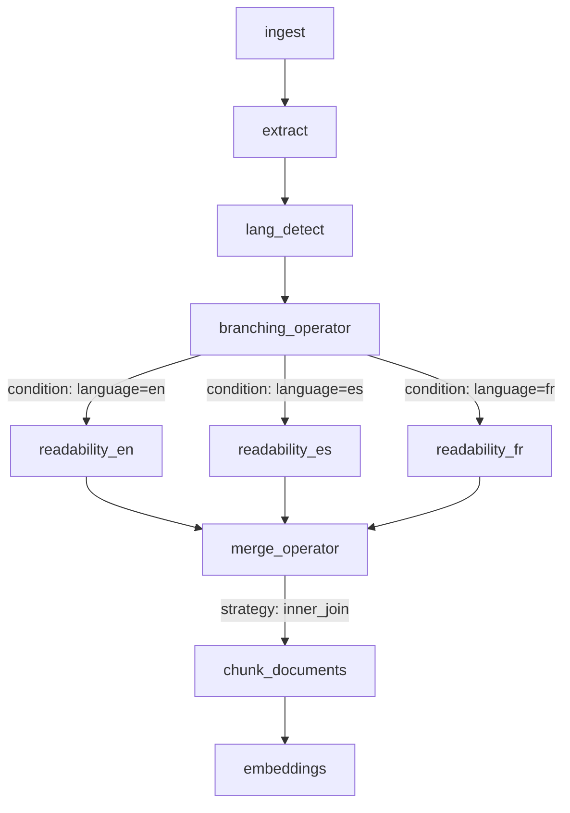

# Proposal: Simplified Flow Authoring Model

## Summary

Creating Datasift flows currently requires users to manually manage low-level runtime graph details such as UUIDs and edge wiring.

This proposal talks about a **simplified flow authoring model** as the shared user-facing format across all 3 entry points:
- CLI
- Python programmatic API
- HTTP API

The goal is to let users describe flows in terms of:

- flow metadata
- operator parameters
- branching and merging structure

and let the system generate the runtime graph details automatically.

---

## Problem

Today, authoring flows is difficult because users must manually handle:

- node UUID generation
- `input_edges`
- `output_edges`
- `node_id_ref`
- Elyra-specific ports, links, and UI metadata in some contexts

This causes several problems:

- error-prone authoring
- hard-to-read flow definitions
- painful branching and merging
- difficult refactoring when changing operator order or dependencies
- duplicated complexity across CLI, Python, and API interfaces

---

## Existing Situation

There are currently multiple flow-related representations in use.

### 1. Runtime-oriented DAG format
Used by the open-source runtime and validation/execution paths.

Characteristics:
- node IDs
- `input_edges`
- `output_edges`
- execution-oriented structure

### 2. Elyra-compatible JSON format
Used for flows created from the UI. It shows UI specific parameters and details.

Characteristics:
- nodes with inputs and outputs
- links with `node_id_ref` and `port_id_ref`
- UI metadata such as positions, labels, colors, and descriptions

### 3. SDK authoring format
Used by the SDK to describe flows at a higher level and generate Elyra-compatible output.

Characteristics:
- ordered `flow` list
- operator `type`
- optional operator `name`
- operator `config`
- explicit branching structure
- merge support through the authored flow definition and generation logic

This proposal is to introduce a new authoring format that will be user facing and will be help users design flows easily.

The distinction between the existing formats and the new format is:
- keep DAG and Elyra as the internal formats
- add a simpler generation/authoring layer on top for users

That way we don’t disrupt existing flow execution, but we still improve the developer experience.

---

## Proposal

Create a **user-friendly authoring model** as the main way to define flows.

### Core idea

Users define flows using:
- `flow_name`
- `description`
- `flow`
- `global_config`

The system then compiles that authoring model into:
- runtime DAG format for execution
- Elyra-compatible JSON for storage purposes

---

## Proposed Authoring Model

### Visual Flow Representation

The following diagram visualizes the multi-language document processing pipeline with branching and merging:



**Flow explanation:**
1. **ingest** - Loads documents from local folder
2. **extract** - Extracts text content using Docling
3. **lang_detect** - Detects document language (en, es, fr)
4. **branching_operator** - Routes documents based on detected language
5. **readability_en/es/fr** - Applies language-specific quality checks
6. **merge_operator** - Combines results using inner_join strategy
7. **chunk_documents** - Splits documents into chunks
8. **embeddings** - Generates vector embeddings

### Example: Multi-Language Document Processing

Complete authoring model example matching the visual flow above:

```json
{
  "flow_name": "Multi-Language Document Processing Pipeline",
  "description": "Process documents in multiple languages with branching and merging",
  "flow": [
    {
      "name": "ingest",
      "type": "ingest_local",
      "config": {
        "input_folder": "./data/multilingual_docs"
      }
    },
    {
      "name": "extract",
      "type": "extract_operator",
      "depends_on": ["ingest"],
      "config": {
        "text_extraction_mode": "docling_library",
        "entity_extraction_mode": "none"
      }
    },
    {
      "name": "lang_detect",
      "type": "language_detection",
      "depends_on": ["extract"],
      "config": {
        "language_provider": "fasttext",
        "filter_unknown_language": false
      }
    },
    {
      "name": "branch_by_language",
      "type": "branching_operator",
      "depends_on": ["lang_detect"],
      "config": {
        "branches": {
          "english": {
            "condition": "detected_language = 'en'"
          },
          "spanish": {
            "condition": "detected_language = 'es'"
          },
          "french": {
            "condition": "detected_language = 'fr'"
          }
        }
      }
    },
    {
      "name": "readability_en",
      "type": "readability",
      "depends_on": ["branch_by_language.english"],
      "config": {
        "language": "en"
      }
    },
    {
      "name": "readability_es",
      "type": "readability",
      "depends_on": ["branch_by_language.spanish"],
      "config": {
        "language": "es"
      }
    },
    {
      "name": "readability_fr",
      "type": "readability",
      "depends_on": ["branch_by_language.french"],
      "config": {
        "language": "fr"
      }
    },
    {
      "name": "merge_languages",
      "type": "merge_operator",
      "depends_on": [
        "readability_en",
        "readability_es",
        "readability_fr"
      ],
      "config": {
        "merge_strategy": "inner_join",
        "join_keys": ["doc_id"]
      }
    },
    {
      "name": "chunk_documents",
      "type": "chunker",
      "depends_on": ["merge_languages"],
      "config": {
        "chunk_size": 1000,
        "chunk_overlap": 100
      }
    },
    {
      "name": "embeddings",
      "type": "embeddings",
      "depends_on": ["chunk_documents"],
      "config": {
        "embeddings_type": "ollama",
        "embeddings_model_id": "nomic-embed-text"
      }
    }
  ],
  "global_config": {
    "doc_column": "content"
  }
}
```

### Key properties

- `flow_name` is the top-level flow identifier
- `flow` is an ordered list of operators
- each operator has a `type`
- operators may optionally have a `name`
- operator configuration lives under `config`
- **branching** uses dot notation: `"operator.branch"` in `depends_on`
- **merging** is explicit through merge operators with configurable strategies
- UUIDs are not authored manually
- edge wiring is not authored manually

### Notes on `config`

`config` should remain flexible and support:
- scalar values
- lists
- nested dictionaries
- provider-specific configuration such as `provider_config`

This is important because some operators have large parameter surfaces and nested configuration structures.

**Note on branching:**
- The branching operator defines named branches in its `branches` parameter
- Downstream operators reference specific branches using **dot notation**: `"operator_name.branch_name"`
- Example: `"branch_by_language.english"` means "the english branch output from branch_by_language"
- This keeps the `depends_on` format consistent (always strings) while being explicit about branch routing
- Branch names are validated to ensure they don't contain dots (see Validation section)

**Benefits of dot notation:**
- ✅ Single, consistent `depends_on` format
- ✅ Explicit branch references
- ✅ Readable and intuitive
- ✅ Easy to validate and compile

---

## Format Comparison: Current vs. Proposed

To illustrate the improvement, here's a simple 2-node flow (ingest → extract) in both formats:

### Current DAG Format

```json
{
  "name": "simple-flow",
  "flow_id": "a1b2c3d4-e5f6-7a8b-9c0d-1e2f3a4b5c6d",
  "description": "Simple ingest and extract flow",
  "storage": "in-memory",
  "execute_type": "local",
  "global_config": {
    "doc_column": "content"
  },
  "dag": [
    {
      "id": "f1a2b3c4-d5e6-4f7a-8b9c-0d1e2f3a4b5c",
      "name": "ingest_local_folder",
      "operator": "ingest_local",
      "config": {
        "input_folder": "./data/documents"
      },
      "input_edges": [],
      "output_edges": [
        {
          "node_id_ref": "e2b3c4d5-f6a7-4b8c-9d0e-1f2a3b4c5d6e"
        }
      ]
    },
    {
      "id": "e2b3c4d5-f6a7-4b8c-9d0e-1f2a3b4c5d6e",
      "name": "extract_with_docling",
      "operator": "extract_operator",
      "config": {
        "text_extraction_mode": "docling_library",
        "entity_extraction_mode": "none"
      },
      "input_edges": [
        {
          "node_id_ref": "f1a2b3c4-d5e6-4f7a-8b9c-0d1e2f3a4b5c"
        }
      ],
      "output_edges": []
    }
  ]
}
```

**Complexity:**
- ❌ 2 manually created UUIDs
- ❌ 4 edge definitions (2 input_edges, 2 output_edges)
- ❌ 52 lines of JSON
- ❌ Error-prone: Must keep node IDs and edge references in sync

### New Authoring Format

```json
{
  "flow_name": "simple-flow",
  "description": "Simple ingest and extract flow",
  "flow": [
    {
      "name": "ingest",
      "type": "ingest_local",
      "config": {
        "input_folder": "./data/documents"
      }
    },
    {
      "name": "extract",
      "type": "extract_operator",
      "depends_on": ["ingest"],
      "config": {
        "text_extraction_mode": "docling_library",
        "entity_extraction_mode": "none"
      }
    }
  ],
  "global_config": {
    "doc_column": "content"
  }
}
```

**Simplicity:**
- ✅ 0 UUIDs (auto-generated by system)
- ✅ 1 simple dependency declaration (`depends_on`)
- ✅ 25 lines of JSON (52% reduction)
- ✅ Safe: No manual ID management, no edge synchronization

### Key Improvements

| Aspect | Current DAG Format | New Authoring Format | Improvement |
|--------|-------------------|---------------------|-------------|
| **Manual UUIDs** | 2 required | 0 required | 100% reduction |
| **Edge Definitions** | 4 (input + output) | 1 (`depends_on`) | 75% reduction |
| **Lines of Code** | 52 lines | 25 lines | 52% reduction |
| **Refactoring Risk** | High (manual sync) | Low (automatic) | Safer |
| **Readability** | Low (graph structure) | High (sequential) | Better |

---

## Why this model

This model works well across all entry points.

### CLI

Users should be able to execute a flow by providing a file in this format.

Example direction:

```bash
datasift-orchestrator --flow-authoring-file invoice_pipeline.json
```

CLI behavior would be:

1. load the authoring model file
2. compile it to the runtime DAG
3. execute the compiled flow

This removes the need for CLI users to hand-author low-level DAG files.

### Python

A Python builder or helper API can construct this model programmatically.

Example:

```python
flow = {
  "flow_name": "Invoice Processing Pipeline",
  "description": "Example authoring model with branching and selective merging",
  "flow": [
    {
      "name": "ingest",
      "type": "ingest_local",
      "config": {
        "input_folder": "./data/invoices"
      }
    },
    {
      "name": "extract",
      "type": "extract_operator",
      "depends_on": ["ingest"],
      "config": {
        "doc_column": "content",
        "text_extraction_mode": "docling_library",
        "entity_extraction_mode": "none"
      }
    },
    {
      "name": "chunk_documents",
      "type": "chunker",
      "depends_on": [
        "extract"
      ],
      "config": {
        "chunk_size": 1000,
        "chunk_overlap": 100
      }
    }
  ],
  "global_config": {}
}
```

This approach works well for Python because:
- it matches the shared authoring model directly
- it handles large parameter surfaces cleanly
- it handles nested structures like `provider_config`
- it keeps the Python API consistent with CLI and API usage

### API

The HTTP API can accept this structure directly as a request payload.

The same authoring model would therefore work consistently across:
- file-based CLI usage
- Python programmatic flow creation
- HTTP API flow creation

---

## Benefits

### Better usability
Users think in terms of operators and branches instead of graph internals.

### Shared model across interfaces
CLI, Python, and API all use the same conceptual representation.

### Easier refactoring
Changing operator order or editing branches does not require manual UUID or edge rewiring.

### Cleaner separation of concerns
We separate:
- authoring model
- runtime execution model
- Elyra/UI export model

---

## Design Decisions

### 1. Top-level field naming
- `flow_name`
- `description`
- `flow`
- `global_config`

### 2. API rollout
The API will support:
- user-authoring format from SDK and Python Programmatic way
- Elyra for UI

### 3. Storage
Flow will be stored in the backend as Elyra JSON

### 4. Editing Flows across formats
Editing a flow created using Elyra format will not be allowed to edit using the authoring format since it will result in loss of data.
Things like UI metadata will not be preserved if you update an Elyra JSON flow with the new authoring format.

---

## Validation Rules

The authoring model includes validation rules to ensure correctness and prevent ambiguity:

### 1. Operator Name Validation

**Rule:** Operator names must be unique within a flow.

**Pattern:** `^[^.\s]+$`

**Rationale:** Ensures unambiguous references in `depends_on` and enables clear error messages.

### 2. Branch Name Validation
**Rule:** Branch names cannot contain dots or spaces. All other characters are allowed.

**Pattern:** `^[^.\s]+$`

**Valid examples:**
- `english`
- `spanish-v2`
- `french_canada`
- `español`
- `branch@v2`
- `path-A`

**Invalid examples:**
- `my.branch` - Contains dot (causes ambiguity in dot notation)
- `my branch` - Contains space (readability issue)
- `` (empty string) - Must not be empty

### 3. Dependency Validation
**Rules:**
- All operators referenced in `depends_on` must exist in the flow
- Branch references (using dot notation) must reference valid branches defined in the branching operator
- No circular dependencies allowed
- Operators cannot depend on themselves

### 4. Merge Operator Validation
**Rules:**
- Merge operators must have at least 2 inputs in `depends_on`
- `merge_strategy` must be one of: `inner_join`, `outer_join`, `union`, `intersection`
- For join strategies (`inner_join`, `outer_join`), `join_keys` must be specified

---

## Phased Direction

### Phase 1
Define the new generic authoring schema for open-source use.

### Phase 2
Add a compiler from the authoring model to runtime DAG.

### Phase 3
Add CLI support for authoring-model files.

### Phase 4
Add Python helper or builder support on top of the authoring model.

### Phase 5
Add API support for authoring-model payloads.