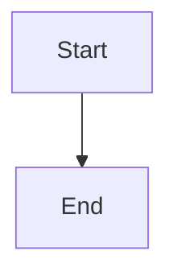
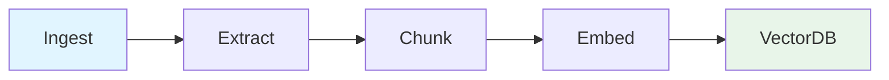

# Documentation Style Guide

This guide defines the writing, formatting, and diagram conventions for all documentation in `docling-pipelines`. Every contributor must follow it. It is the single source of truth when in doubt about formatting — do not invent new conventions.

## Table of Contents

- [File and directory conventions](#file-and-directory-conventions)
- [Markdown structure](#markdown-structure)
- [Headings](#headings)
- [Prose style and tone](#prose-style-and-tone)
- [Code fences](#code-fences)
- [Mermaid diagrams](#mermaid-diagrams)
- [Tables](#tables)
- [Links and references](#links-and-references)
- [Lists](#lists)
- [Callouts and admonitions](#callouts-and-admonitions)
- [Changelog entries](#changelog-entries)
- [Operator documentation template](#operator-documentation-template)
- [Common mistakes and how to fix them](#common-mistakes-and-how-to-fix-them)

---

## File and directory conventions

| Location | Purpose |
| --- | --- |
| `README.md` | Project overview, setup, quick start |
| `ARCHITECTURE.md` | System design, component diagrams, design decisions |
| `QUICKSTART.md` | Fastest path to a running pipeline |
| `CONTRIBUTING.md` | How to contribute code and docs |
| `CHANGELOG.md` | Release notes (Keep a Changelog format) |
| `docs/guides/` | How-to guides (authoring, security, custom operators, etc.) |
| `docs/operators/<category>/<operator_name>_readme.md` | Per-operator user guide — **one file per operator, no separate config file** |
| `docs/reference/` | API and schema reference |
| `docs/integrations/<name>/` | Integration-specific docs (OpenSearch, Milvus, Prefect) |
| `docs/internals/` | Maintainer-facing architectural notes (maintainers only, never linked from user docs) |

**Rules**

- File names use `UPPER_SNAKE_CASE.md` for root-level docs and `lower_snake_case.md` for files inside `docs/`.
- Every new doc must be linked from at least one parent file (e.g., `docs/README.md`, `CONTRIBUTING.md`, or a parent `README.md`).
- Do not create duplicate documentation for the same topic. Extend an existing file instead.
- **Do not create `<name>_config.md` files alongside operator READMEs.** All parameter and configuration content belongs in `README.md`. The separate config file pattern is retired.

---

## Markdown structure

- Every file starts with a single `# Title` (H1). There is **exactly one** H1 per file.
- A `## Table of Contents` section with anchor links is required for any file longer than 80 lines.
- Sections are separated by a single blank line before the heading.
- Use a horizontal rule `---` to separate major top-level sections when a visual break aids readability.
- Wrap prose lines at **120 characters** or fewer. Code blocks, tables, and URLs are exempt.
- Do not add trailing whitespace.

---

## Headings

```
# H1 — File title only, once per file
## H2 — Major section
### H3 — Sub-section
#### H4 — Detail within a sub-section
```

- Never skip levels (e.g., do not jump from `##` to `####`).
- Use sentence case for headings ("Operator configuration" not "Operator Configuration").
- Do not add inline code backticks or bold markers inside headings unless the heading is a code symbol (`## \`DocpipeFlowManager\``).

---

## Prose style and tone

- Write in **present tense**: "The operator returns a PyArrow table." — not "will return".
- Write in **second person** when addressing the reader directly: "You can configure…" — not "One can configure…"
- Avoid first-person plural ("we built", "we recommend") — write for the reader, not for the author.
- Be direct. Omit filler phrases like "Please note that", "It is worth mentioning that", "As you can see".
- Define acronyms on first use: "directed acyclic graph (DAG)".
- Audience is an **intermediate developer** familiar with Python and basic software architecture. Do not explain git, pip, or basic Python.

---

## Code fences

### Opening and closing

Always use exactly **three backticks** to open and close a fenced block:

````
```python
# correct
```
````

Never use four or more backticks (`````mermaid`, ````python`). Editors and renderers are inconsistent about how they handle 4-backtick fences, and it has caused rendering failures in this repository.

### Language tags

Always specify a language tag immediately after the opening fence. Use the following tags consistently:

| Language / format | Tag |
| --- | --- |
| Python | `python` |
| Bash / shell commands | `bash` |
| JSON flow file | `json` |
| YAML config | `yaml` |
| Mermaid diagram | `mermaid` |
| Plain text / output | `text` |
| SQL | `sql` |
| Dockerfile | `dockerfile` |

```bash
# correct
export PYTHONPATH="$(pwd)/src:${PYTHONPATH}"
```

```
# wrong — no language tag
export PYTHONPATH="$(pwd)/src:${PYTHONPATH}"
```

### Nesting

Never nest fenced blocks. If you need to show a fence inside a fence (e.g., in a style guide like this one), use a surrounding four-backtick block for the outer wrapper only — and document why you are doing so.

---

## Mermaid diagrams

Mermaid diagrams are the standard for all architecture and flow diagrams in this project. Follow these rules to avoid broken renders.

### Fence syntax

```

```

- Open with ` ```mermaid ` (exactly three backticks + the word `mermaid`).
- Close with ` ``` ` on its own line.
- No content after the closing fence on the same line.

### Diagram type selection

| Use case | Diagram type |
| --- | --- |
| Component hierarchy, layered architecture | `graph TD` (top-down) |
| Data flows, pipelines, operator chains | `graph LR` (left-right) |
| Class relationships, inheritance | `classDiagram` |
| Sequence of calls between components | `sequenceDiagram` |
| State machines | `stateDiagram-v2` |

### Node labels

- Keep node labels short (1–5 words).
- Use `[Label]` for process/component nodes, `([Label])` for rounded (start/end), `{Label}` for decisions.
- Escape special characters inside labels. Square brackets `[` `]` inside a label must use HTML entities or quotes: `A["Label [with brackets]"]`.
- Do not use the `%%` comment syntax inside a node label. Put `%%` comments on their own line before the node.

### Styles

- Only use `style <NodeId> fill:<color>` for a small set of key nodes that need visual distinction. Do not style every node.
- Use the project colour palette for consistency:

| Layer | Fill colour |
| --- | --- |
| Interface / CLI | `#e1f5ff` |
| Orchestration | `#fff4e1` |
| Data / PyArrow | `#e8f5e9` |
| Integration | `#f3e6ff` |
| Quality operators | `#e6ffe6` |

### Validation

**Test every Mermaid diagram before committing.** Paste the block into [mermaid.live](https://mermaid.live) and confirm it renders without errors. A diagram that does not render is a documentation bug.

### Example — correct diagram



---

## Tables

- Every table must have a header row and a separator row (`| --- | --- |`).
- Column widths should be consistent. Pad cells with spaces for readability (optional but encouraged).
- Align the content of numeric or status columns: `| ---: |` for right-align, `| :---: |` for centre.
- Tables are for reference data. Do not use a table where a list would be clearer.

```markdown
| Parameter | Type | Default | Description |
| --- | --- | --- | --- |
| `chunk_size` | `int` | `512` | Maximum characters per chunk. |
| `overlap` | `int` | `50` | Character overlap between chunks. |
```

---

## Links and references

- Use **relative links** for all internal files: `[guide](../guides/FOO.md)` not `https://github.com/…/FOO.md`.
- Link text must be descriptive: `[Operator reference](../reference/OPERATORS.md)` — not `[click here]` or `[here]`.
- When linking to a specific section, use the lowercase kebab-case anchor: `[Mermaid diagrams](#mermaid-diagrams)`.
- For links to source files, link to the file without a line number — line numbers are fragile and break when the file changes: `[AbstractOperator](src/docpipe/core/operators/abstract_operator.py)`.
- Verify all links resolve in the rendered Markdown before submitting a PR.

---

## Lists

- Use `-` for unordered lists throughout the file — do not mix `-` and `*`.
- Use `1.` `2.` `3.` for ordered lists when sequence matters.
- Do not mix ordered and unordered items at the same indentation level.
- Add a blank line before and after a list that is adjacent to a paragraph.
- Nested lists must be indented by **4 spaces** (not 2).

---

## Callouts and admonitions

GitHub-flavoured Markdown renders `> [!NOTE]`, `> [!WARNING]`, and `> [!TIP]` as styled callouts. Use them sparingly:

```markdown
> [!NOTE]
> This behaviour changed in v0.2.0. See the migration guide.

> [!WARNING]
> Do not set `DS_LOG_JSON=True` in development — it disables human-readable output.

> [!TIP]
> Run `docling-pipelines --list-operators --verbose` to see all available parameters.
```

- Use **NOTE** for important context that the reader might miss.
- Use **WARNING** for actions that may cause data loss, security issues, or hard-to-debug failures.
- Use **TIP** for shortcuts or time-savers.
- Do not use `> **Note:**` (plain blockquote bold) — it does not render as a callout.

---

## Changelog entries

All changes must be recorded in [`CHANGELOG.md`](../../CHANGELOG.md) using [Keep a Changelog](https://keepachangelog.com/en/1.1.0/) format.

```markdown
## [Unreleased]

### Added
- `MyNewOperator` — short description of what it does and why. (#123)

### Changed
- `chunker`: `chunk_type` now defaults to `"simple"` instead of `"semantic"`. (#456)

### Fixed
- `VectorDBOperator`: fixed index not being created when `auto_create_index=True`. (#789)

### Deprecated
- `IngestLocalOperator.path` parameter — use `paths` (list) instead. Removed in v2.0.

### Removed
- `OldOperator` — deprecated since v0.3. Use `NewOperator` instead.
```

Rules:

- Each entry is a single line starting with the affected component in backticks.
- Include the GitHub issue or PR number in parentheses at the end.
- Entries go under `## [Unreleased]` until a release is cut.
- Do not edit past release sections.

---

## Operator documentation template

Every operator file lives at `docs/operators/<category>/<operator_name>_readme.md`. There is no separate `*_config.md` file. All content lives in this single file, in the section order below.

Section names are a contract — do not rename them. An agent or developer navigating operator docs must find `## Parameters` in the same place in every README.

```markdown
# OperatorClassName

One-sentence description. Short name: `operator_type` · Category: Functional | Extract | Ingest | Quality | VectorDB

## Overview

What problem it solves. When to use it vs alternatives. 3–5 sentences. No code blocks.

## Key Features

- Feature one (5–8 bullets max, no sub-bullets)
- Feature two

## Operator Configuration

The first code block in the file. A complete, copy-pasteable flow node showing all required
parameters and optional parameters at their default values. Comment each parameter inline.

\```json
{
  "name": "my_op",
  "type": "operator_short_name",
  "depends_on": ["previous_op"],
  "config": {
    "operator_params": {
      "param_name": "value",        // required — what it controls
      "optional_param": 512         // optional, default 512
    }
  }
}
\```

## Parameters

Flat table. One row per parameter. Add a "Provider" column when a param applies only to
certain providers. Do not split into sub-sections by provider.

| Parameter | Type | Required | Default | Description |
| --- | --- | --- | --- | --- |
| `param_name` | `string` | Yes | — | What the parameter controls. |
| `optional_param` | `int` | No | `512` | What it controls. |

## Output Columns

Every column this operator adds to the PyArrow table. Required for agent readability —
downstream operators depend on knowing what columns are available.

| Column | Type | Description |
| --- | --- | --- |
| `column_name` | `string` | What this column contains. |

## Examples

2–3 named examples. Each is a self-contained flow node snippet with a one-line title.

### Example 1: \<use case\>

\```json
{ ... }
\```

### Example 2: \<use case\>

\```json
{ ... }
\```

## Troubleshooting

Format: **Error or symptom** → cause → fix. No prose paragraphs.

**`ConnectionRefusedError` connecting to Ollama** — Ollama is not running. Start it with `ollama serve`.

## Architecture

Optional. Maintainers only. Always the last section.
Move hexagonal architecture diagrams, adapter patterns, and internal class details here —
or link to `docs/internals/OPERATOR_ARCHITECTURE_<name>.md` for long content.
```

**What is forbidden in an operator README:**

- Architecture diagrams before `## Architecture` (the last section)
- Migration notes or "Phase N" implementation history — those go in `CHANGELOG.md`
- A separate `<name>_config.md` file in the same directory
- `## Contributing`, `## License`, or `## Version History` sections
- Duplicating content from `docs/reference/OPERATORS.md` — link instead

---

## Common mistakes and how to fix them

| Mistake | Fix |
| --- | --- |
| ` ````mermaid ` (four backticks) | Change to ` ```mermaid ` |
| Mermaid block never closed | Add ` ``` ` on its own line after the last diagram line |
| Typo in node label (`ExtactOperator`) | Verify node labels against actual class names |
| Missing language tag on code fence | Add the appropriate tag (e.g., `python`, `bash`, `json`) |
| Skipped heading level (`##` → `####`) | Insert the missing `###` level |
| Bare URL for internal doc (`https://github.com/.../FOO.md`) | Replace with relative path (`../guides/FOO.md`) |
| Link text is "here" or "click here" | Use descriptive text (`[Operator reference](…)`) |
| No header separator in table | Add `\| --- \| --- \|` after the header row |
| Mixed `-` and `*` in the same list | Standardise on `-` |
| Future tense ("will return") | Change to present tense ("returns") |
| Created multiple files in one operator directory | Merge all content into the single `<operator_name>_readme.md` |
| Architecture content above `## Troubleshooting` | Move to `## Architecture` (last section) or `docs/internals/` |
| `## Operator Configuration` shows partial snippet | Show a complete flow node JSON with all required params and defaults |
| Missing `## Output Columns` section | Add a table of every column this operator adds to the PyArrow table |

---

*Questions about this guide? Open a [GitHub Discussion](https://github.com/IBM/docling-pipelines/discussions) or propose a change via pull request.*
