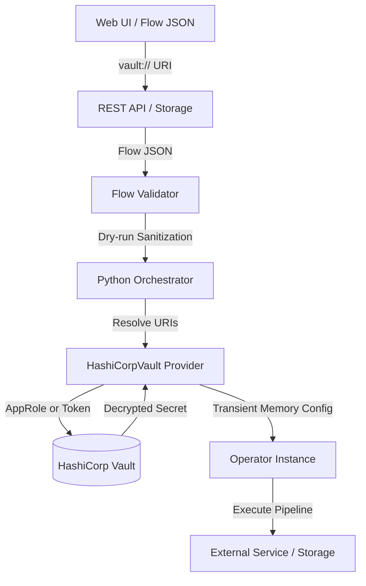

# HashiCorp Vault Integration Guide

This guide covers the setup, configuration, and end-to-end usage of HashiCorp Vault for credential resolution in Docling Pipelines.

---

## Table of Contents

- [Overview](#overview)
- [Architecture and Secret Resolution](#architecture-and-secret-resolution)
- [Vault Secret Storage Patterns](#vault-secret-storage-patterns)
  - [URI specification](#uri-specification)
  - [Pattern A — Individual field reference](#pattern-a--individual-field-reference)
  - [Pattern B — Structured JSON blob](#pattern-b--structured-json-blob)
- [Supported Operators and Credential Fields](#supported-operators-and-credential-fields)
- [Vault Configuration](#vault-configuration)
  - [Configuration file (`docling-pipelines-config.yaml`)](#configuration-file-docling-pipelines-configyaml)
  - [Authentication modes](#authentication-modes)
  - [Environment variables](#environment-variables)
- [Step-by-Step Setup and Usage Walkthrough](#step-by-step-setup-and-usage-walkthrough)
  - [Step 1 — Start Vault server](#step-1--start-vault-server)
  - [Step 2 — Enable KV v2 engine](#step-2--enable-kv-v2-engine)
  - [Step 3 — Write secrets into Vault](#step-3--write-secrets-into-vault)
  - [Step 4 — Configure AppRole authentication](#step-4--configure-approle-authentication)
  - [Step 5 — Run flow with Vault references](#step-5--run-flow-with-vault-references)
- [Web UI Canvas Usage](#web-ui-canvas-usage)
- [Security, Sanitization, and Masking Guarantees](#security-sanitization-and-masking-guarantees)
- [Troubleshooting](#troubleshooting)

---

## Overview

In enterprise pipelines, operators often require credentials such as database passwords, API tokens, or cloud storage keys. Hardcoding credentials in flow definitions risks exposure in version control and shared databases.

The HashiCorp Vault integration replaces cleartext credentials in flow definitions with immutable `vault://` URIs:
- **Zero credential persistence**: Flow files contain only abstract pointer URIs.
- **Just-in-time resolution**: Secrets are fetched dynamically from Vault in memory right before operator initialization.
- **Clean authoring round-trips**: Web UI and API endpoints retain `vault://` pointers without masking them as `********`.

---

## Architecture and Secret Resolution



1. **Validation**: `FlowValidator` detects `vault://` strings on sensitive fields and substitutes valid mock types so validation succeeds without querying Vault.
2. **Resolution**: `PythonOperatorExecutor` scans the operator configuration, identifies `vault://` patterns, and resolves each reference via `SecretProvider`.
3. **Execution**: The operator receives resolved credentials in memory during execution. The transient values are never written back to disk or logs.

---

## Vault Secret Storage Patterns

### URI specification

```
vault://<provider>/<secret_path>#<field_key>
```

- `<provider>`: Registered provider name (e.g., `hashicorp`).
- `<secret_path>`: Vault KV v2 path (e.g., `docpipe/s3` or `secret/data/docpipe/s3`).
- `#<field_key>`: Target key in the secret's data map (e.g., `#access_key`).

### Pattern A — Individual field reference

Store each credential as an individual key-value pair in Vault. Recommended for standard credentials:

**Vault Secret Data (`secret/docpipe/openai`):**
```json
{
  "api_key": "<API_KEY>"
}
```

**Flow JSON:**
```json
{
  "type": "embeddings",
  "name": "embeddings_node",
  "config": {
    "provider": "openai",
    "provider_config": {
      "api_key": "vault://hashicorp/docpipe/openai#api_key"  # pragma: allowlist secret
    }
  }
}
```

### Pattern B — Structured JSON blob

For complex or multi-parameter credentials (e.g. cloud service accounts or full connection credential blocks), store the entire credential dictionary as a serialized JSON string in Vault.

Docpipe automatically parses the resolved string into a dictionary if the target configuration field expects an object:

**Vault Secret Data (`secret/docpipe/storage_full`):**
```json
{
  "connection_creds": "{\"client_id\": \"<CLIENT_ID>\", \"region\": \"us-east-1\"}"
}
```

**Flow JSON:**
```json
{
  "type": "storage_output",
  "name": "s3_export",
  "config": {
    "destination_type": "s3",
    "destination_config": {
      "bucket_name": "pipeline-results",
      "credentials": "vault://hashicorp/docpipe/s3_full#connection_creds"
    }
  }
}
```

---

## Supported Operators and Credential Fields

| Operator | Config Path | Description |
|---|---|---|
| **`ingest_source`** | `connection_params.access_key` | S3 / Cloud access key |
| | `connection_params.secret_key` | S3 / Cloud secret key |
| | `connection_params.credentials` | Full credential dictionary or JSON string |
| | `connection_params.client_secret` | SharePoint / OAuth client secret |
| **`embeddings`** | `provider_config.api_key` | LLM / Embedding provider API key |
| **`extract_operator`** | `llm_config.api_key` | Extraction LLM provider API key |
| | `entity_extraction.api_key` | Entity extraction LLM API key |
| **`document_classifier`** | `provider_config.api_key` | Classification LLM provider API key |
| **`vectordb`** | `provider_config.username` | OpenSearch / Milvus username |
| | `provider_config.password` | OpenSearch / Milvus password |
| | `provider_config.api_key` | Vector DB API token |
| **`storage_output`** | `destination_config.credentials` | Full credential dictionary or JSON string |
| | `destination_config.provider_config.access_key` | Destination S3 access key |
| | `destination_config.provider_config.secret_key` | Destination S3 secret key |
| | `destination_config.provider_config.client_secret` | Destination SharePoint secret |

---

## Vault Configuration

### Configuration file (`docling-pipelines-config.yaml`)

Configure Vault under the `secrets` section:

```yaml
secrets:
  vault:
    enabled: true
    provider: hashicorp
    url: "http://127.0.0.1:8200"
    mount_point: "secret"
    auth_method: "approle"      # "approle" (production) or "token" (dev/testing)
    role_id: ""                 # or set VAULT_ROLE_ID env var
    secret_id: ""               # or set VAULT_SECRET_ID env var
    token: ""                   # or set VAULT_TOKEN env var (if auth_method is token)
    timeout: 30
```

### Authentication modes

- **AppRole (`auth_method: approle`)**: Recommended for production services. Uses `role_id` and `secret_id` to acquire tokens with automatic lifecycle renewal.
- **Token (`auth_method: token`)**: Recommended for local testing. Pass a developer or service token directly.

### Environment variables

Environment variables override file configuration:

| Variable | Description | Default |
|---|---|---|
| `VAULT_ENABLED` | Enables secret provider when `true` | `false` |
| `VAULT_PROVIDER` | Provider identifier in `vault://` URIs | `hashicorp` |
| `VAULT_ADDR` / `VAULT_URL` | HashiCorp Vault address | `http://127.0.0.1:8200` |
| `VAULT_MOUNT_POINT` | KV v2 mount point | `secret` |
| `VAULT_AUTH_METHOD` | Authentication mode (`approle` or `token`) | `approle` |
| `VAULT_ROLE_ID` | AppRole Role ID | `""` |
| `VAULT_SECRET_ID` | AppRole Secret ID | `""` |
| `VAULT_TOKEN` | Token for token-based auth | `""` |
| `VAULT_TIMEOUT` | Request timeout in seconds | `30` |

---

## Step-by-Step Setup and Usage Walkthrough

### Step 1 — Start Vault server

Using Docker or Podman:
```bash
docker run -d \
  --name vault-server \
  -p 8200:8200 \
  -e 'VAULT_DEV_ROOT_TOKEN_ID=dev-root-token' \
  -e 'VAULT_DEV_LISTEN_ADDRESS=0.0.0.0:8200' \
  docker.io/hashicorp/vault:1.17 server -dev
```

### Step 2 — Enable KV v2 engine

```bash
export VAULT_ADDR="http://127.0.0.1:8200"
export VAULT_TOKEN="dev-root-token"

vault secrets enable -version=2 -path=secret kv || true
```

### Step 3 — Write secrets into Vault

```bash
# Store API key for embeddings operator
vault kv put secret/docpipe/embeddings api_key="<YOUR_EMBEDDINGS_API_KEY>"  # pragma: allowlist secret

# Store credentials for vectordb operator
vault kv put secret/docpipe/opensearch \
  username="<YOUR_DB_USERNAME>" \
  password="<YOUR_DB_PASSWORD>"  # pragma: allowlist secret
```

### Step 4 — Configure AppRole authentication

```bash
# Enable AppRole
vault auth enable approle

# Create read policy
cat << 'EOF' > docpipe-read.hcl
path "secret/data/docpipe/*" {
  capabilities = ["read"]
}
EOF
vault policy write docpipe-read docpipe-read.hcl

# Create AppRole
vault write auth/approle/role/docpipe-role \
  secret_id_ttl=0 \
  token_num_uses=0 \
  token_ttl=1h \
  token_max_ttl=24h \
  token_policies="docpipe-read"

# Fetch credentials
export VAULT_ROLE_ID=$(vault read -format=json auth/approle/role/docpipe-role/role-id | jq -r .data.role_id)
export VAULT_SECRET_ID=$(vault write -f -format=json auth/approle/role/docpipe-role/secret-id | jq -r .data.secret_id)
```

### Step 5 — Run flow with Vault references

Configure docpipe environment variables:
```bash
export VAULT_ENABLED=true
export VAULT_AUTH_METHOD=approle
export VAULT_ROLE_ID="$VAULT_ROLE_ID"
export VAULT_SECRET_ID="$VAULT_SECRET_ID"

# Validate flow DAG without exposing credentials
docling-pipelines --flow-file path/to/flow.json --validate

# Execute flow with dynamic Vault resolution
docling-pipelines --flow-file path/to/flow.json
```

---

## Web UI Canvas Usage

The web UI canvas provides interactive support for `vault://` URIs through the `VaultInput` component in operator properties panels.

1. **Vault Toggle**: Click the Vault icon next to any sensitive credential field to toggle between direct input and Vault reference mode.
2. **Prefix Management**: The UI automatically applies the `vault://hashicorp/` prefix; you enter only the path and key (e.g., `docpipe/opensearch#password`).
3. **Safe Round-Tripping**: Loading an existing flow displaying `vault://` URIs leaves the reference intact when saved.

---

## Security, Sanitization, and Masking Guarantees

1. **Flow Validation (`FlowValidator`)**:
   Sensitive fields containing `vault://` strings are replaced in-memory with mock values during schema verification. If Vault is not configured in the environment, a non-blocking warning is emitted.
2. **REST API Scrubbing (`FlowMapper`)**:
   Standard plain passwords in flow definitions are masked as `********` when returned from API endpoints (`GET /api/v1/flows`). `vault://` URIs are preserved unmasked for UI round-tripping.
3. **Log Sanitization**:
   Resolved secret values are never printed in application logs. Execution logs record only the configuration path names being resolved (e.g., `['provider_config.username', 'provider_config.password']`), never the secrets themselves.

---

## Troubleshooting

| Symptom | Cause | Solution |
|---|---|---|
| `Cannot connect to Vault at http://127.0.0.1:8200` | Vault server unreachable | Verify Vault is running (`curl $VAULT_ADDR/v1/sys/health`) |
| `Key 'api_key' not found at vault path 'docpipe/embeddings'` | Secret key name or path mismatch | Check secret contents with `vault kv get secret/docpipe/embeddings` |
| `VAULT_URI_MALFORMED` | URI missing provider or key | Follow `vault://<provider>/<path>#<key>` format |
| `Unregistered vault provider 'hashicorp'` | Vault provider not enabled | Set `VAULT_ENABLED=true` or update `docling-pipelines-config.yaml` |
| `'str' object is not a mapping` | Complex field expected JSON object | Ensure the Vault secret field contains a valid JSON string or dictionary |
