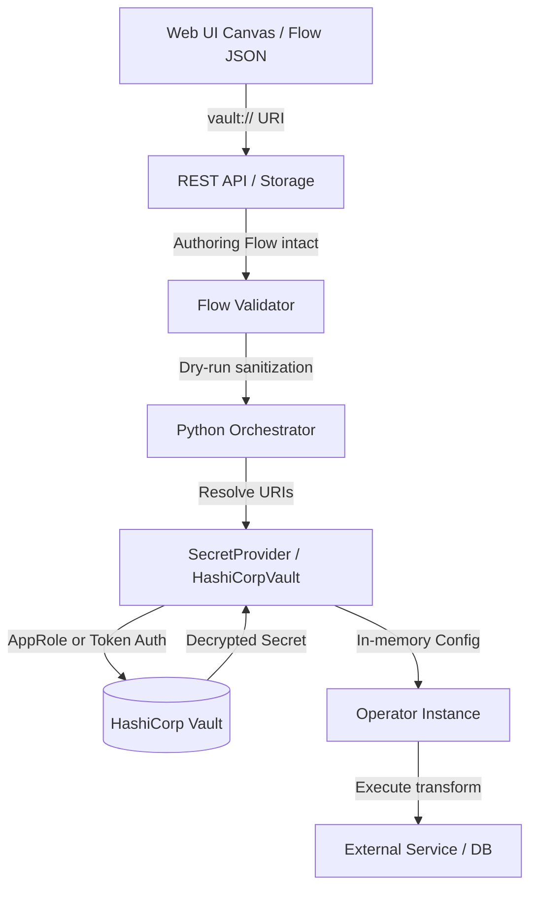

# HashiCorp Vault Integration

HashiCorp Vault enables secure credential resolution for Docling Pipelines without storing sensitive credentials in flow JSON files, source control, or database storage.

---

## Table of Contents

- [Overview](#overview)
- [Architecture](#architecture)
- [URI Format and Patterns](#uri-format-and-patterns)
  - [URI syntax](#uri-syntax)
  - [Pattern A — individual field references](#pattern-a--individual-field-references)
  - [Pattern B — whole credential JSON blobs](#pattern-b--whole-credential-json-blobs)
- [Supported Operators and Fields](#supported-operators-and-fields)
- [Configuration](#configuration)
  - [Configuration file (`docling-pipelines-config.yaml`)](#configuration-file-docling-pipelines-configyaml)
  - [Authentication methods](#authentication-methods)
  - [Environment variables](#environment-variables)
- [Web UI and Properties Panel Usage](#web-ui-and-properties-panel-usage)
- [Validation and Masking Lifecycle](#validation-and-masking-lifecycle)
- [Testing Guide](#testing-guide)
- [Troubleshooting](#troubleshooting)

---

## Overview

In standard flow execution, operators often require sensitive configuration parameters such as database passwords, API tokens, and cloud storage access keys. Hardcoding these credentials inside flow definitions presents security risks.

The Vault integration replaces cleartext credentials in flow definitions with immutable `vault://` URIs. When a pipeline runs:
1. Flow JSON stores only reference pointers (e.g., `vault://hashicorp/docpipe/embeddings#api_key`).
2. Flow validation sanitizes and verifies reference formats without exposing or leaking credentials.
3. The orchestrator resolves references dynamically from Vault just prior to operator initialization in memory.
4. Resolved values remain strictly transient and are never written back to disk, database, or API response payloads.

---

## Architecture

The following diagram illustrates the lifecycle of a `vault://` reference from authoring to operator execution:



### Key Components

- **`SecretProvider` / `HashiCorpVault`** (`src/docpipe/integrations/secrets/`): Interacts with Vault's KV v2 engine, handles authentication (Token or AppRole), auto-refreshes tokens, and auto-deserializes JSON strings into dictionaries.
- **`VaultInitializer`** (`src/docpipe/integrations/secrets/vault_initializer.py`): Initializes configured secret providers on server and CLI startup.
- **`FlowValidator`** (`src/docpipe/core/orchestration/flow_validator.py`): Sanitizes `vault://` placeholders during schema validation so schema type-check rules pass without network dependency on Vault.
- **`PythonOperatorExecutor`** (`src/docpipe/core/orchestration/python/python_operator_executor.py`): Recursively walks operator configuration trees and replaces all `vault://` paths with resolved values before instantiating operator classes.
- **`FlowMapper`** (`src/docpipe/api/dto/mappers/flow_mapper.py`): Preserves `vault://` strings unchanged in API responses so authoring workflows round-trip cleanly without masking them as `********`.

---

## URI Format and Patterns

### URI syntax

Every Vault secret reference follows the standard format:

```
vault://<provider>/<secret_path>#<field_key>
```

| Component | Description | Example |
|---|---|---|
| `vault://` | Protocol scheme identifier | `vault://` |
| `<provider>` | Registered provider name in config | `hashicorp` |
| `<secret_path>` | Path to the secret in Vault KV v2 mount | `docpipe/s3` or `secret/data/docpipe/s3` |
| `#<field_key>` | Specific key within the secret's data map | `#access_key` |

### Pattern A — individual field references

Use this pattern to store secrets as distinct key-value pairs in Vault. Recommended for granular access control and standard credential fields:

**Vault Secret Data (`docpipe/s3`):**
```json
{
  "auth_token": "placeholder-token-value"
}
```

**Flow Configuration:**
```json
{
  "type": "embeddings",
  "name": "embed",
  "config": {
    "provider": "openai",
    "provider_config": {
      "api_key": "vault://hashicorp/docpipe/openai#api_key"  # pragma: allowlist secret
    }
  }
}
```

### Pattern B — whole credential JSON blobs

For connectors requiring complex or multiline credentials (such as Google Cloud Service Account keys, complete cloud credential sets, or SharePoint configuration), store the whole credential JSON as a single field value in Vault.

Docpipe automatically parses the resolved string into a dictionary if the target field expects an object or dictionary:

**Vault Secret Data (`docpipe/s3_full`):**
```json
{
  "connection_creds": "{\"key_id\": \"sample-id\", \"region\": \"us-east-1\"}"
}
```

**Flow Configuration:**
```json
{
  "type": "storage_output",
  "name": "export_s3",
  "config": {
    "destination_type": "s3",
    "destination_config": {
      "bucket_name": "processed-output",
      "credentials": "vault://hashicorp/docpipe/s3_full#connection_creds"
    }
  }
}
```

---

## Supported Operators and Fields

All sensitive credential fields across docpipe operators support `vault://` URIs:

| Operator | Parameter Path | Description |
|---|---|---|
| **`ingest_source`** | `connection_params.access_key` | S3 / Cloud access key |
| | `connection_params.secret_key` | S3 / Cloud secret key |
| | `connection_params.credentials` | JSON credential string or dictionary reference |
| | `connection_params.client_secret` | SharePoint / OAuth client secret |
| **`embeddings`** | `provider_config.api_key` | LLM API key (OpenAI, WatsonX, Ollama) |
| **`extract_operator`** | `llm_config.api_key` | Extraction LLM provider API key |
| | `entity_extraction.api_key` | Named entity recognition LLM API key |
| **`document_classifier`** | `provider_config.api_key` | Classification LLM provider API key |
| **`vectordb`** | `provider_config.username` | OpenSearch / Milvus username |
| | `provider_config.password` | OpenSearch / Milvus password |
| | `provider_config.api_key` | Vector DB API key / token |
| **`storage_output`** | `destination_config.credentials` | Full credential dictionary or string |
| | `destination_config.provider_config.access_key` | Destination S3 access key |
| | `destination_config.provider_config.secret_key` | Destination S3 secret key |
| | `destination_config.provider_config.client_secret` | Destination SharePoint secret |

---

## Configuration

### Configuration file (`docling-pipelines-config.yaml`)

Enable Vault in `docling-pipelines-config.yaml` under the `secrets` block:

```yaml
secrets:
  vault:
    enabled: true
    provider: hashicorp
    url: "http://127.0.0.1:8200"
    mount_point: "secret"
    auth_method: "approle"      # "approle" (production) or "token" (dev/testing)
    role_id: ""                 # set via VAULT_ROLE_ID environment variable
    secret_id: ""               # set via VAULT_SECRET_ID environment variable
    token: ""                   # set via VAULT_TOKEN environment variable (if auth_method is token)
    timeout: 30
```

### Authentication methods

#### 1. AppRole Authentication (Production Recommended)
AppRole authentication is intended for automated services. Docpipe uses a `role_id` and `secret_id` to authenticate against Vault, obtain a transient client token, and automatically manage token renewal.

1. Enable AppRole in Vault:
   ```bash
   vault auth enable approle
   ```
2. Create a policy (`docpipe-read-policy.hcl`):
   ```hcl
   path "secret/data/docpipe/*" {
     capabilities = ["read"]
   }
   ```
   ```bash
   vault policy write docpipe-read docpipe-read-policy.hcl
   ```
3. Create AppRole binding:
   ```bash
   vault write auth/approle/role/docpipe-role \
     secret_id_ttl=0 \
     token_num_uses=0 \
     token_ttl=1h \
     token_max_ttl=24h \
     token_policies="docpipe-read"
   ```
4. Fetch Role ID and generate Secret ID:
   ```bash
   vault read auth/approle/role/docpipe-role/role-id
   vault write -f auth/approle/role/docpipe-role/secret-id
   ```

#### 2. Token Authentication (Development / Local Testing)
For local testing or development, pass a static developer or root token directly:
```bash
export VAULT_AUTH_METHOD=token
export VAULT_TOKEN="root-dev-token"
```

### Environment variables

Environment variables override values configured in `docling-pipelines-config.yaml`:

| Variable | Description | Default |
|---|---|---|
| `VAULT_ENABLED` | Set `true` to enable Vault secret provider | `false` |
| `VAULT_PROVIDER` | Provider identifier used in URIs | `hashicorp` |
| `VAULT_ADDR` or `VAULT_URL` | HashiCorp Vault server address | `http://127.0.0.1:8200` |
| `VAULT_MOUNT_POINT` | KV v2 secrets engine mount point | `secret` |
| `VAULT_AUTH_METHOD` | Auth mechanism: `approle` or `token` | `approle` |
| `VAULT_ROLE_ID` | AppRole Role ID | `""` |
| `VAULT_SECRET_ID` | AppRole Secret ID | `""` |
| `VAULT_TOKEN` | Vault token (when `VAULT_AUTH_METHOD=token`) | `""` |
| `VAULT_TIMEOUT` | Connection timeout in seconds | `30` |

---

## Web UI and Properties Panel Usage

The Docling Pipelines web canvas provides integrated support for Vault credential references via the shared `VaultInput` component.

### Interactive properties panel controls

When editing any sensitive parameter in an operator's properties panel:

1. **Direct Entry vs Vault Reference Toggle**:
   - Click the **Vault** icon or mode toggle next to the input field to switch from direct text entry to Vault reference mode.
2. **Simplified Reference Input**:
   - In Vault mode, the prefix `vault://hashicorp/` is managed automatically. You only type the path and key: `docpipe/opensearch#password`.
3. **Round-Trip Safety**:
   - Existing `vault://` URIs in loaded flows are automatically detected and displayed in Vault mode.
   - Saving the flow preserves the exact `vault://...` URI in the flow definition without converting it into a plaintext masked password.

---

## Validation and Masking Lifecycle

To prevent credential leakage while maintaining robust flow authoring and execution:

1. **Schema Validation (`FlowValidator`)**:
   - When validating flow JSON, fields marked as `sensitive` that contain `vault://` strings are replaced in-memory with dummy mock values matching the required schema type (e.g. valid dummy strings).
   - If Vault is not configured in the active environment, the validator issues a clear warning (`Config key '...' references unregistered vault provider '...'`) instead of failing execution unconditionally.
2. **REST API Masking (`FlowMapper`)**:
   - Direct cleartext credentials stored in flows are masked as `********` when retrieved through REST endpoints (`GET /api/v1/flows`).
   - `vault://` URI references are recognized as safe pointer strings and are returned unmasked, enabling UI canvas editors to load and edit the flow without corrupting the reference.
3. **Logging Hygiene**:
   - Resolved secret values are never printed in application logs. Operator executor logs record only the configuration path names being resolved (e.g. `['provider_config.username', 'provider_config.password']`), never the resolved values.

---

## Integration Guide

For end-to-end setup instructions, AppRole configuration walkthroughs, and security details, see the [Vault Integration Guide](../../guides/VAULT_INTEGRATION_GUIDE.md).

---

## Troubleshooting

| Symptom | Cause | Solution |
|---|---|---|
| `Cannot connect to Vault at http://127.0.0.1:8200` | Vault service is stopped or unreachable | Check if Vault is running (`curl $VAULT_ADDR/v1/sys/health`) |
| `Key 'api_key' not found at vault path 'docpipe/embeddings'` | Secret key mismatch or secret not written | Check secret path in Vault: `vault kv get secret/docpipe/embeddings` |
| `VAULT_URI_MALFORMED` | URI does not follow `vault://<provider>/<path>#<key>` | Ensure URI has valid provider and includes `#field_key` suffix |
| `Unregistered vault provider 'hashicorp'` | Vault provider is not initialized | Ensure `VAULT_ENABLED=true` or configure `secrets.vault` in config YAML |
| `'str' object is not a mapping` | Complex credential field expected dictionary | Use Pattern B: ensure Vault contains valid JSON string or dictionary |
