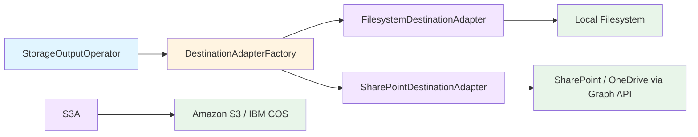

# StorageOutputOperator

Writes pipeline documents to a pluggable storage destination. Short name: `storage_output` · Category: Storage

## Overview

`StorageOutputOperator` accepts the standard Docling Pipelines PyArrow table and writes document content to a
configured destination using one of three modes: writing extracted content, copying original
binaries, or producing a full per-document export bundle. It is designed to be placed at the end
of a pipeline or at any checkpoint where durable output is needed. Unlike `DocumentSetOperator`
(which persists to DuckDB), this operator writes files to external destinations such as a local
filesystem, and is the right choice when you need portable, human-readable output.

## Key Features

- Three write modes covering the most common output use cases
- Pluggable destination backend via `DestinationAdapterFactory` — supports `filesystem`, `s3`, `ibm_cos`, `sharepoint`, and `onedrive`
- Path templating with per-document variables (`{doc_id}`, `{name}`, `{year}`, `{month}`, `{day}`, `{relative_dir}`)
- Hierarchical output that mirrors the source directory tree; when multiple source paths are configured each root is namespaced by its folder name
- Overwrite control — skip existing files and record `skipped` status per document
- Automatic subdirectory creation (`create_dirs`)
- Per-document write outcome tracked in output columns (`write_status`, `write_error`, etc.)
- All input columns are passed through unchanged

## Operator Configuration

```json
{
  "type": "storage_output",
  "name": "write_output",
  "config": {
    "mode": "processed_content",
    "destination_config": {
      "provider": "filesystem",
      "provider_config": {
        "root_path": "/output/docs",
        "create_dirs": true
      },
      "credentials": {}
    },
    "output_format": {
      "content_format": "md",
      "include_metadata_sidecar": false
    },
    "output_structure": {
      "type": "flat",
      "path_template": "{year}/{month}/{doc_id}.{ext}",
      "overwrite_existing": true
    }
  },
  "depends_on": ["extract"]
}
```

## Parameters

### Top-level

| Parameter | Type | Required | Default | Description |
| --- | --- | --- | --- | --- |
| `mode` | string | Yes | — | Write mode: `processed_content`, `refetch_original`, or `comprehensive_export` |
| `destination_config` | object | Yes | — | Destination connection configuration |
| `output_format` | object | No | `{}` | Controls content format and metadata sidecar output |
| `output_structure` | object | No | `{}` | Controls output directory structure and file naming |

### `destination_config`

| Field | Type | Required | Default | Description |
| --- | --- | --- | --- | --- |
| `provider` | string | Yes | — | Destination adapter name: `filesystem`, `s3`, `ibm_cos`, `sharepoint`, or `onedrive` |
| `provider_config` | object | Yes | — | Provider-specific connection parameters (see below) |
| `credentials` | object | No | `{}` | Provider-specific credentials |

### Provider: `filesystem`

| Field | Type | Required | Default | Description |
| --- | --- | --- | --- | --- |
| `root_path` | string | Yes | — | Base directory to write files into. `~` is expanded automatically. |
| `create_dirs` | bool | No | `true` | Auto-create missing subdirectories |

No credentials required — set `"credentials": {}`.

### Provider: `s3`

**`provider_config`**

| Field | Type | Required | Default | Description |
| --- | --- | --- | --- | --- |
| `bucket` | string | Yes | — | Target S3 bucket name |
| `prefix` | string | Yes | — | Key prefix prepended to every object written (writing to bucket root is not permitted) |
| `region` | string | No | — | AWS region, e.g. `us-east-1` |
| `endpoint_url` | string | No | — | Custom endpoint for S3-compatible storage (IBM COS, MinIO). Must start with `http://` or `https://` |
| `create_dirs` | bool | No | `true` | When `false`, the prefix must already contain at least one object; otherwise the write is refused |
| `verify_expected_bucket_owner` | bool | No | `false` | When `true`, verifies the bucket owner matches the caller's AWS account via STS |

**`credentials`**

| Field | Type | Required | Description |
| --- | --- | --- | --- |
| `access_key` | string | Yes | AWS access key ID. Use `"${ENV_VAR}"` to read from an environment variable |
| `secret_key` | string | Yes | AWS secret access key. Use `"${ENV_VAR}"` to read from an environment variable |

### Provider: `ibm_cos`

`ibm_cos` is an alias for `s3` — it uses the same `S3DestinationAdapter` with a custom
`endpoint_url` pointing to IBM Cloud Object Storage. No separate adapter or credentials type is
needed.

**`provider_config`**

| Field | Type | Required | Default | Description |
| --- | --- | --- | --- | --- |
| `bucket` | string | Yes | — | Target IBM COS bucket name |
| `prefix` | string | Yes | — | Key prefix prepended to every object written |
| `endpoint_url` | string | Yes | — | IBM COS regional endpoint, e.g. `https://s3.us-south.cloud-object-storage.appdomain.cloud` |
| `create_dirs` | bool | No | `true` | When `false`, prefix must already contain at least one object |

**`credentials`** — same as `s3` (HMAC access key and secret key).

### Provider: `sharepoint`

Writes to a SharePoint document library via the Microsoft Graph API (client credentials flow).
Requires the `msal` and `requests` packages.

**`provider_config`**

| Field | Type | Required | Default | Description |
| --- | --- | --- | --- | --- |
| `drive_id` | string | Yes | — | Microsoft Graph drive ID of the SharePoint document library |
| `folder_path` | string | No | `""` | Destination folder within the drive, e.g. `/Processed Documents`. Leave empty to write to the drive root. |
| `create_dirs` | bool | No | `true` | When `false`, validate_destination checks the folder already exists |
| `graph_api_version` | string | No | `v1.0` | Microsoft Graph API version: `v1.0` or `beta` |

**`credentials`**

| Field | Type | Required | Description |
| --- | --- | --- | --- |
| `client_id` | string | Yes | Azure AD application (client) ID. Supports `"${ENV_VAR}"` resolution |
| `client_secret` | string | Yes | Azure AD client secret. Supports `"${ENV_VAR}"` resolution |
| `tenant_id` | string | Yes | Azure AD tenant (directory) ID. Supports `"${ENV_VAR}"` resolution |

### `output_format`

| Field | Type | Required | Default | Description |
| --- | --- | --- | --- | --- |
| `content_format` | string | No | `md` | Extension for the content file: `md`, `txt`, or `json` |
| `include_metadata_sidecar` | bool | No | `false` | Write a `.meta.json` sidecar per document — `comprehensive_export` mode only |

### `output_structure`

| Field | Type | Required | Default | Description |
| --- | --- | --- | --- | --- |
| `type` | string | No | `flat` | `flat` (all files in one directory) or `hierarchical` (mirrors source tree via `relative_path` metadata) |
| `path_template` | string | No | `{name}.{ext}` | Template string for the output file path relative to `root_path` |
| `overwrite_existing` | bool | No | `true` | When `false`, existing files are skipped and recorded with `write_status = skipped` |

### Path template variables

| Variable | Resolves to |
| --- | --- |
| `{doc_id}` | Document `id` column value |
| `{name}` | Document name stem (without extension) |
| `{ext}` | Output file extension (`content_format` for `processed_content`; original format for `refetch_original` and `comprehensive_export`) |
| `{year}` | UTC year at write time, e.g. `2026` |
| `{month}` | UTC month, zero-padded, e.g. `06` |
| `{day}` | UTC day, zero-padded, e.g. `14` |
| `{relative_dir}` | Directory portion of the source relative path (e.g. `sub01` for a file ingested as `sub01/report.pdf`). Empty string when the file is at the source root. |

When no `path_template` is provided and `type` is `flat`, files are written as `{name}.{ext}`.
When `type` is `hierarchical` and no template is given, the full source relative path is used to
mirror the source directory structure. Relative paths are resolved from `metadata["relative_path"]`
(filesystem ingest), `metadata["key"]` minus the source prefix (S3 ingest), or the absolute `path`
column minus the common ingest root (local ingest).

## Output Columns

All input columns are passed through unchanged. The following columns are appended:

| Column | Type | Description |
| --- | --- | --- |
| `write_status` | string | `success`, `failed`, or `skipped` |
| `destination_path` | string | Full path of the written file; `null` on failure |
| `bytes_written` | int64 | Number of bytes written; `0` on failure |
| `write_error` | string | Error message when `write_status` is `failed` or `skipped`; `null` on success |

## Examples

### Example 1: Write extracted content as markdown (filesystem)

```json
{
  "type": "storage_output",
  "name": "write_markdown",
  "config": {
    "mode": "processed_content",
    "destination_config": {
      "provider": "filesystem",
      "provider_config": { "root_path": "/output/markdown" },
      "credentials": {}
    },
    "output_format": { "content_format": "md" },
    "output_structure": { "path_template": "{year}/{month}/{name}.{ext}" }
  },
  "depends_on": ["extract"]
}
```

### Example 2: Write extracted content to S3

Credentials are read from environment variables at runtime.

```json
{
  "type": "storage_output",
  "name": "write_to_s3",
  "config": {
    "mode": "processed_content",
    "destination_config": {
      "provider": "s3",
      "provider_config": {
        "bucket": "my-export-bucket",
        "prefix": "exports/markdown/",
        "region": "us-east-1",
        "create_dirs": true
      },
      "credentials": {
        "access_key": "${S3_DEST_ACCESS_KEY}",
        "secret_key": "${S3_DEST_SECRET_KEY}"
      }
    },
    "output_format": { "content_format": "md" },
    "output_structure": {
      "type": "hierarchical",
      "path_template": "{year}/{month}/{name}.{ext}",
      "overwrite_existing": true
    }
  },
  "depends_on": ["extract"]
}
```

### Example 3: Archive original files to S3, skipping existing

```json
{
  "type": "storage_output",
  "name": "archive_originals_s3",
  "config": {
    "mode": "refetch_original",
    "destination_config": {
      "provider": "s3",
      "provider_config": {
        "bucket": "my-archive-bucket",
        "prefix": "originals/",
        "region": "us-east-1",
        "create_dirs": true
      },
      "credentials": {
        "access_key": "${S3_DEST_ACCESS_KEY}",
        "secret_key": "${S3_DEST_SECRET_KEY}"
      }
    },
    "output_structure": {
      "type": "hierarchical",
      "overwrite_existing": false
    }
  },
  "depends_on": ["ingest"]
}
```

### Example 4: Write extracted content to IBM COS

`ibm_cos` behaves identically to `s3` — supply the IBM COS HMAC credentials and the regional
endpoint URL.

```json
{
  "type": "storage_output",
  "name": "write_to_ibm_cos",
  "config": {
    "mode": "processed_content",
    "destination_config": {
      "provider": "ibm_cos",
      "provider_config": {
        "bucket": "my-cos-bucket",
        "prefix": "exports/markdown/",
        "endpoint_url": "https://s3.us-south.cloud-object-storage.appdomain.cloud",
        "create_dirs": true
      },
      "credentials": {
        "access_key": "${COS_DEST_ACCESS_KEY}",
        "secret_key": "${COS_DEST_SECRET_KEY}"
      }
    },
    "output_format": { "content_format": "md" },
    "output_structure": {
      "type": "hierarchical",
      "overwrite_existing": true
    }
  },
  "depends_on": ["extract"]
}
```


### Example 5: Write extracted content to SharePoint

```json
{
  "type": "storage_output",
  "name": "write_to_sharepoint",
  "config": {
    "mode": "processed_content",
    "destination_config": {
      "provider": "sharepoint",
      "provider_config": {
        "drive_id": "${SHAREPOINT_DRIVE_ID}",
        "folder_path": "/Processed Documents",
        "create_dirs": true
      },
      "credentials": {
        "client_id": "${SHAREPOINT_CLIENT_ID}",
        "client_secret": "${SHAREPOINT_CLIENT_SECRET}",
        "tenant_id": "${SHAREPOINT_TENANT_ID}"
      }
    },
    "output_format": { "content_format": "md" },
    "output_structure": {
      "type": "hierarchical",
      "overwrite_existing": true
    }
  },
  "depends_on": ["extract"]
}
```

### Example 6: Full compliance export with metadata sidecar (filesystem)

```json
{
  "type": "storage_output",
  "name": "compliance_export",
  "config": {
    "mode": "comprehensive_export",
    "destination_config": {
      "provider": "filesystem",
      "provider_config": { "root_path": "/export/contracts", "create_dirs": true },
      "credentials": {}
    },
    "output_format": { "content_format": "md", "include_metadata_sidecar": true },
    "output_structure": {
      "path_template": "{year}/{month}/{doc_id}/{name}.{ext}",
      "overwrite_existing": true
    }
  },
  "depends_on": ["extract"]
}
```

Output layout per document:

```text
/export/contracts/2026/06/abc123/
├── report.pdf            ← original binary
├── report.content.md     ← extracted content
└── report.meta.json      ← metadata sidecar
```

## Troubleshooting

**`ValueError: 'mode' is required`** — The `mode` field is missing from the operator config. Add one
of `processed_content`, `refetch_original`, or `comprehensive_export`.

**`ValueError: Unknown destination adapter: 'xyz'`** — The `provider` field in `destination_config`
does not match any registered adapter. Use `filesystem`, `s3`, `ibm_cos`, `sharepoint`, or `onedrive`.

**`write_status = failed` with `destination directory does not exist and create_dirs is disabled`** —
The output directory (filesystem), prefix (S3/IBM COS), or folder path (SharePoint) does not exist
and `create_dirs` is `false`. Set `create_dirs: true` or create the path manually before running the
flow.

**`write_status = failed` with `S3 destination bucket '...' is not accessible`** — The S3 bucket is
not reachable. Check that the bucket name, region, credentials, and network access are correct. For
S3-compatible storage, verify `endpoint_url`.

**`write_status = failed` with `boto3 is not installed`** — The `s3` provider requires the `boto3`
package. Install it with `uv pip install boto3`.

**`ValueError: Missing required S3 credential: 'access_key'`** — The `access_key` field is absent
from `credentials`. If using environment variables, ensure `${S3_DEST_ACCESS_KEY}` is set in the
shell before running the flow.

**`ValueError: Missing required S3 destination path: set 'prefix'`** — The `prefix` field is absent
from `provider_config`. Writing to the S3 bucket root is not permitted; set a non-empty prefix.

**`write_status = failed` with `SharePoint document library '...' is not accessible`** — The Graph
API could not reach the drive. Verify `drive_id`, the Azure AD app credentials, and that the app
has `Files.ReadWrite.All` or `Sites.ReadWrite.All` permission granted in the tenant.

**`write_status = failed` with `destination folder path does not exist and create_dirs is disabled`**
— The `folder_path` does not exist in the drive and `create_dirs` is `false`. Set `create_dirs:
true` or create the folder in SharePoint before running the flow.

**`write_status = failed` with `Microsoft Graph dependencies are not installed`** — The `sharepoint`
provider requires `msal` and `requests`. Install with `uv pip install msal requests`.

**`ValueError: Missing required SharePoint credential: 'client_id'`** — A required Azure AD
credential field is absent. Ensure all three fields (`client_id`, `client_secret`, `tenant_id`) are
present in `credentials` and that any `${ENV_VAR}` references are set in the shell.

**`ValueError: Missing required SharePoint connection parameter: 'drive_id'`** — The `drive_id`
field is missing from `provider_config`. Obtain it from the SharePoint site's document library
settings or via the Microsoft Graph `GET /sites/{site-id}/drives` endpoint.

**`write_status = failed` with `Could not fetch binary content for 'name' from source`** — Modes
`refetch_original` and `comprehensive_export` re-fetch binaries via the upstream ingest source.
Ensure the `ingest_source` global config is populated and the source is accessible.

**`write_status = skipped`** — A file already exists at the destination path and
`overwrite_existing` is `false`. This is expected behaviour; inspect the `write_error` column for
the exact path.

## Architecture

`StorageOutputOperator` follows the hexagonal architecture pattern established by the ingest side
of the framework. The operator itself is the application layer; it delegates I/O to a
[`DestinationAdapterPort`](../../../src/docpipe/core/operators/storage/ports/outbound/destination_adapter.py)
implementation selected by [`DestinationAdapterFactory`](../../../src/docpipe/core/operators/storage/adapters/outbound/destinations/factories/destination_factory.py).



New destination adapters self-register via the `@register_destination_adapter` decorator and
require no changes to the operator itself. Each adapter implements `validate_destination()` for
pre-flight reachability checks and `resolve_destination_path()` to convert a relative template
path into a provider-specific absolute path (filesystem path or S3 object key).

**Operating modes and required input columns:**

| Mode | Required columns | Source connection needed |
| --- | --- | --- |
| `processed_content` | `id`, `name`, `content` | No |
| `refetch_original` | `id`, `name`, `path`, `document_format` | Yes |
| `comprehensive_export` | `id`, `name`, `path`, `content`, `metadata`, `document_format` | Yes |
