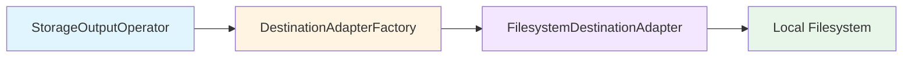

# StorageOutputOperator

Writes pipeline documents to a pluggable storage destination. Short name: `storage_output` · Category: Storage

## Overview

`StorageOutputOperator` accepts the standard docpipe PyArrow table and writes document content to a
configured destination using one of three modes: writing extracted content, copying original
binaries, or producing a full per-document export bundle. It is designed to be placed at the end
of a pipeline or at any checkpoint where durable output is needed. Unlike `DocumentSetOperator`
(which persists to DuckDB), this operator writes files to external destinations such as a local
filesystem, and is the right choice when you need portable, human-readable output.

## Key Features

- Three write modes covering the most common output use cases
- Pluggable destination backend via `DestinationAdapterFactory` (currently: `filesystem`)
- Path templating with per-document variables (`{doc_id}`, `{name}`, `{year}`, `{month}`, `{day}`)
- Hierarchical output that mirrors the source directory tree
- Overwrite control — skip existing files and record `skipped` status per document
- Automatic subdirectory creation (`create_dirs`)
- Per-document write outcome tracked in output columns (`write_status`, `write_error`, etc.)
- All input columns are passed through unchanged

## Operator Configuration

```json
{
  "type": "storage_output",
  "name": "write_output",
  "config": {
    "mode": "processed_content",
    "destination_config": {
      "provider": "filesystem",
      "connection_params": {
        "root_path": "/output/docs",
        "create_dirs": true
      },
      "credentials": {}
    },
    "output_format": {
      "content_format": "md",
      "include_metadata_sidecar": false
    },
    "output_structure": {
      "type": "flat",
      "path_template": "{year}/{month}/{doc_id}.{ext}",
      "overwrite_existing": true
    }
  },
  "depends_on": ["extract"]
}
```

## Parameters

### Top-level

| Parameter | Type | Required | Default | Description |
| --- | --- | --- | --- | --- |
| `mode` | string | Yes | — | Write mode: `processed_content`, `refetch_original`, or `comprehensive_export` |
| `destination_config` | object | Yes | — | Destination connection configuration |
| `output_format` | object | No | `{}` | Controls content format and metadata sidecar output |
| `output_structure` | object | No | `{}` | Controls output directory structure and file naming |

### `destination_config`

| Field | Type | Required | Default | Description |
| --- | --- | --- | --- | --- |
| `provider` | string | Yes | — | Destination adapter name — currently `filesystem` |
| `connection_params` | object | Yes | — | Provider-specific connection parameters (see below) |
| `credentials` | object | No | `{}` | Provider-specific credentials |

### Filesystem `connection_params`

| Field | Type | Required | Default | Description |
| --- | --- | --- | --- | --- |
| `root_path` | string | Yes | — | Base directory to write files into. `~` is expanded automatically. |
| `create_dirs` | bool | No | `true` | Auto-create missing subdirectories |

### `output_format`

| Field | Type | Required | Default | Description |
| --- | --- | --- | --- | --- |
| `content_format` | string | No | `md` | Extension for the content file: `md`, `txt`, or `json` |
| `include_metadata_sidecar` | bool | No | `false` | Write a `.meta.json` sidecar per document — `comprehensive_export` mode only |

### `output_structure`

| Field | Type | Required | Default | Description |
| --- | --- | --- | --- | --- |
| `type` | string | No | `flat` | `flat` (all files in one directory) or `hierarchical` (mirrors source tree via `relative_path` metadata) |
| `path_template` | string | No | `{name}.{ext}` | Template string for the output file path relative to `root_path` |
| `overwrite_existing` | bool | No | `true` | When `false`, existing files are skipped and recorded with `write_status = skipped` |

### Path template variables

| Variable | Resolves to |
| --- | --- |
| `{doc_id}` | Document `id` column value |
| `{name}` | Document name stem (without extension) |
| `{ext}` | Output file extension (`content_format` for `processed_content`; original format for `refetch_original` and `comprehensive_export`) |
| `{year}` | UTC year at write time, e.g. `2026` |
| `{month}` | UTC month, zero-padded, e.g. `06` |
| `{day}` | UTC day, zero-padded, e.g. `14` |

When no `path_template` is provided and `type` is `flat`, files are written as `{name}.{ext}`.
When `type` is `hierarchical` and no template is given, the `relative_path` value from the
`metadata` column is used to mirror the source directory structure.

## Output Columns

All input columns are passed through unchanged. The following columns are appended:

| Column | Type | Description |
| --- | --- | --- |
| `write_status` | string | `success`, `failed`, or `skipped` |
| `destination_path` | string | Full path of the written file; `null` on failure |
| `bytes_written` | int64 | Number of bytes written; `0` on failure |
| `write_error` | string | Error message when `write_status` is `failed` or `skipped`; `null` on success |

## Examples

### Example 1: Write extracted content as markdown

```json
{
  "type": "storage_output",
  "name": "write_markdown",
  "config": {
    "mode": "processed_content",
    "destination_config": {
      "provider": "filesystem",
      "connection_params": { "root_path": "/output/markdown" },
      "credentials": {}
    },
    "output_format": { "content_format": "md" },
    "output_structure": { "path_template": "{year}/{month}/{name}.{ext}" }
  },
  "depends_on": ["extract"]
}
```

### Example 2: Archive original files, skipping existing

```json
{
  "type": "storage_output",
  "name": "archive_originals",
  "config": {
    "mode": "refetch_original",
    "destination_config": {
      "provider": "filesystem",
      "connection_params": { "root_path": "/archive/originals", "create_dirs": true },
      "credentials": {}
    },
    "output_structure": {
      "type": "hierarchical",
      "overwrite_existing": false
    }
  },
  "depends_on": ["ingest"]
}
```

### Example 3: Full compliance export with metadata sidecar

```json
{
  "type": "storage_output",
  "name": "compliance_export",
  "config": {
    "mode": "comprehensive_export",
    "destination_config": {
      "provider": "filesystem",
      "connection_params": { "root_path": "/export/contracts", "create_dirs": true },
      "credentials": {}
    },
    "output_format": { "content_format": "md", "include_metadata_sidecar": true },
    "output_structure": {
      "path_template": "{year}/{month}/{doc_id}/{name}.{ext}",
      "overwrite_existing": true
    }
  },
  "depends_on": ["extract"]
}
```

Output layout per document:

```text
/export/contracts/2026/06/abc123/
├── report.pdf            ← original binary
├── report.content.md     ← extracted content
└── report.meta.json      ← metadata sidecar
```

## Troubleshooting

**`ValueError: 'mode' is required`** — The `mode` field is missing from the operator config. Add one
of `processed_content`, `refetch_original`, or `comprehensive_export`.

**`ValueError: Unknown destination adapter: 'xyz'`** — The `provider` field in `destination_config`
does not match any registered adapter. Currently only `filesystem` is available.

**`write_status = failed` with `destination directory does not exist and create_dirs is disabled`** —
The output directory does not exist and `create_dirs` is `false`. Set `create_dirs: true` or create
the directory manually before running the flow.

**`write_status = failed` with `Could not fetch binary content for 'name' from source`** — Modes
`refetch_original` and `comprehensive_export` re-fetch binaries via the upstream ingest source.
Ensure the `ingest_source` global config is populated and the source is accessible.

**`write_status = skipped`** — A file already exists at the destination path and
`overwrite_existing` is `false`. This is expected behaviour; increase verbosity or inspect the
`write_error` column for the exact path.

## Architecture

`StorageOutputOperator` follows the hexagonal architecture pattern established by the ingest side
of the framework. The operator itself is the application layer; it delegates I/O to a
[`DestinationAdapterPort`](../../../src/docpipe/core/operators/storage/ports/outbound/destination_adapter.py)
implementation selected by [`DestinationAdapterFactory`](../../../src/docpipe/core/operators/storage/adapters/outbound/destinations/factories/destination_factory.py).


```mermaid
graph LR
    SOO[StorageOutputOperator] --> FAC[DestinationAdapterFactory]
    FAC --> FSA[FilesystemDestinationAdapter]
    FSA --> FS[Local Filesystem]

    style SOO fill:#e1f5ff
    style FAC fill:#fff4e1
    style FSA fill:#f3e6ff
    style FS fill:#e8f5e9
```

New destination adapters self-register via the `@register_destination_adapter` decorator and
require no changes to the operator itself.

**Operating modes and required input columns:**

| Mode | Required columns | Source connection needed |
| --- | --- | --- |
| `processed_content` | `id`, `name`, `content` | No |
| `refetch_original` | `id`, `name`, `path`, `document_format` | Yes |
| `comprehensive_export` | `id`, `name`, `path`, `content`, `metadata`, `document_format` | Yes |
